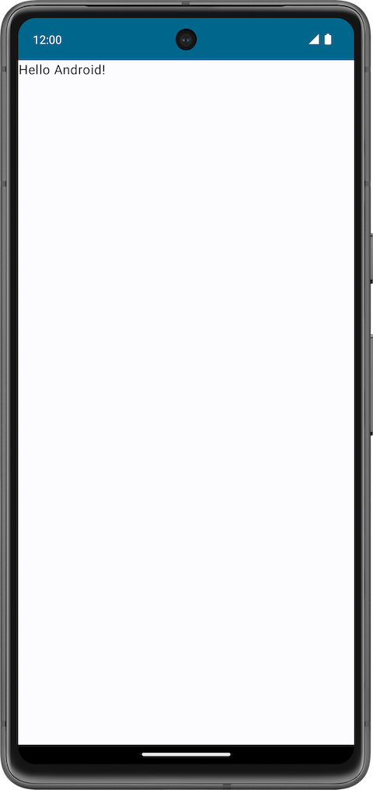
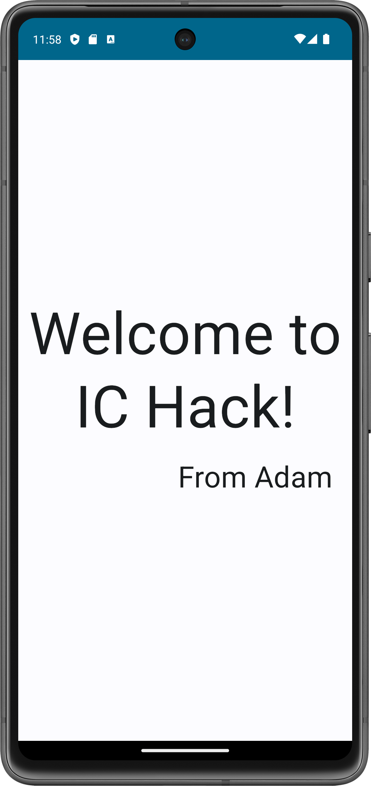
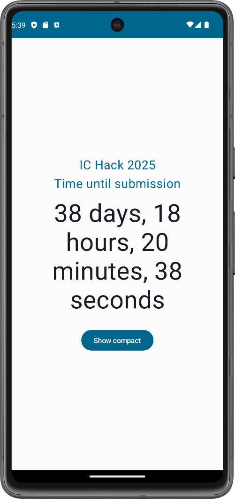

# Android Development with Kotlin

In this guide, we will cover the basics of Android development, using **Kotlin**, Google's preferred language for Android mobile development since 2019, and **Jetpack Compose**, Android's modern UI toolkit.

We will assume a basic working knowledge of Kotlin, and general object-oriented programming (OOP) concepts, but if you need some further guidance on this, don't worry! The [official Kotlin documentation](https://kotlinlang.org/docs/home.html) is a very useful tool.

To follow along, you'll probably also want to download **Android Studio**, the official IDE for Android app development. Use the [detailed installation instructions](https://developer.android.com/codelabs/basic-android-kotlin-compose-install-android-studio) for Windows, macOS, and Linux on the Android Developers website.

## An IC Hack Greeting App

For our first demo, we'll build a simple app that allows us to greet IC Hack attendees!

It'll display a simple "Welcome to IC Hack!" message with a customisable tagline.

### Basic Set-up

Follow the instructions below to initialise the empty project we'll be able to build off:

- Open Android Studio.
- Create a new *Empty Activity* and name it how you like (I personally named my app 'Welcome to IC Hack'). An **Activity** represents a single screen in your app — we're creating an empty one to build from scratch.
- You can leave the other settings (*Minimum SDK*, *Build configuration language*) as the default.
- Once Android Studio has created and built your project, you should be able to click the green ▶️ *Run* button next to 'app' in the top toolbar. Your app should display as follows:



> **Having trouble?** If Gradle sync fails or you see "No devices available", grab one of the mentors — they'll help you get set up!

### Understanding the generated code

Before we start making changes, let's understand what Android Studio created for us in `MainActivity.kt`:

- **`MainActivity`** is the entry point of your app — it's the Activity that runs when your app launches
- **`onCreate()`** is called when the Activity starts; think of it as your starting point
- **`setContent { }`** is where we define our UI using Compose
- **`WelcomeToICHackTheme { }`** wraps our content in a consistent theme (colours, typography, etc.)
- **`Surface`** is a container that applies the theme's background colour

Now let's talk about **composable functions**, the building blocks of your UI.

### Composable Functions

These are the basic building block of a UI in Jetpack Compose.

A composable function describes some part of your UI and is otherwise like any regular function in Kotlin, except for the fact that it doesn't return anything. Instead, it takes some input (its function parameters) and generates what's shown on the screen.

Composable functions are identified by the `@Composable` **annotation** before the function declaration. It informs the Compose compiler that this function is intended to convert data into UI.

#### Examples of composable functions

Take a look at the `MainActivity.kt` file in our generated project.

You should see two composable functions at the bottom: `Greeting()` and `GreetingPreview()`.

Both of these represent UI elements within our app, as desired: `Greeting()` encompasses a simple text box that displays a basic message, and `GreetingPreview()` uses the extra `@Preview` annotation to display this text box within a preview window in our IDE (which can be opened from the `Split` or `Design` views in the top-right).

Try toggling the `showBackground = true` parameter of the Preview annotation. You could even add `showSystemUI` and `name` parameters to customise your preview further.

---

Before we dive into the code further, we need to learn about a few more Compose concepts.

#### Layout Composables

So far, we've seen `Text()` — a composable that displays text on screen. But what if we want to display *multiple* pieces of text? And control how they're arranged?

This is where **layout composables** come in. These are special composables that don't display content themselves, but instead control how their *children* (the composables inside them) are positioned.

The three most common layout composables are:

- **`Column`**: arranges children vertically (stacked top to bottom)
- **`Row`**: arranges children horizontally (side by side)
- **`Box`**: stacks children on top of each other (like layers)

For our greeting card, we want a main message at the top and a "from" line below it. This is a perfect use case for `Column`!

#### Units: dp and sp

When specifying sizes in Compose, we use special units that adapt to different screen densities:

- **`dp`** (density-independent pixels) — used for spacing, padding, and layout dimensions. A button that's `48.dp` wide will appear roughly the same physical size on any device.
- **`sp`** (scalable pixels) — used specifically for text sizes. These respect the user's font size preferences in their device settings, making your app more accessible.

#### Modifiers: Styling and Layout

You may have noticed that `Greeting()` has a `modifier` parameter. **Modifiers** are how we style and position composables in Jetpack Compose — think of them as a chain of instructions that describe how a composable should look and behave.

Modifiers can be chained together:

```kotlin
Modifier
    .padding(16.dp)       // Add space around the element
    .fillMaxWidth()       // Make it as wide as its parent
    .align(Alignment.End) // Position it to the right
```

Each modifier in the chain is applied in order, which can affect the result — for example, adding padding *before* a background colour gives a different effect than adding it *after*.

---

Now we're ready to update our code! We'll make these changes step by step.
> Android Studio should prompt you to add imports automatically as you type (just press `Alt+Enter` when you see a red underline).

#### Step 1: Wrap your `Text` in a `Column`

Find your `Greeting()` function. Currently it just contains a single `Text` composable. Wrap that `Text` inside a `Column { }` block:

```kotlin
Column {
    Text(
        text = "Hello $name!",
        modifier = modifier
    )
}
```

Remember, `Column` arranges its children vertically — so anything we add inside will stack top to bottom.

#### Step 2: Add a second `Text` for the "from" line

Inside your `Column`, after the first `Text`, add another `Text` composable. This one will display who the greeting is from. What text should it show? What parameters might you pass to it?

Try it yourself first, then check the example project if you get stuck!

#### Step 3: Update the function parameters

Currently `Greeting()` takes a `name` parameter, but now we want to display two different pieces of text: a message and a "from" line.

Update the function signature to take `message: String` and `from: String` instead of `name: String`. Then update your two `Text` composables to use these new parameters.

#### Step 4: Style your text

Plain text works, but let's make it look more like a greeting card! Try adding these parameters to your `Text` composables:

- `fontSize` — how large should your text be? Try something like `72.sp` for the main message and `36.sp` for the "from" line
- `lineHeight` — controls spacing when text wraps. Try `90.sp` for the main message
- `textAlign` — try `TextAlign.Center` for centred text

For the "from" text, can you use `Modifier.padding()` and `Modifier.align()` to add some spacing and push it to the right side?

#### Step 5: Update your call sites

Now that `Greeting()` has different parameters, you'll see errors where it's called. Update the call in `onCreate()` and in `GreetingPreview()` to pass your new `message` and `from` arguments.

What message do you want to display? Don't forget to add your own name!

#### Step 6: Run your app

Click *Run `app`* again in the top toolbar. You should now see your personalised IC Hack greeting displayed on screen!

Mine looks like this:



> **Stuck?** The complete example is available in the [`welcome-to-ic-hack` directory](/android-development/welcome-to-ic-hack/). Compare your code to `MainActivity.kt` if you need a hint!

## An IC Hack Countdown Timer

For our second demo, we'll build a countdown timer that shows how long until IC Hack begins! This will introduce some more advanced concepts: **state management**, **coroutines**, and **interactive UI** with buttons.

### Project Set-up

Create a new *Empty Activity* project in Android Studio, just like before. I've named mine 'IC Hack Countdown'.

### State in Compose

So far, our greeting app has been entirely *static* — it displays the same thing every time. But a countdown timer needs to *change* over time. How do we make our UI update?

This is where **state** comes in.

**State** is any data that can change during the lifetime of your app. When state changes, Compose automatically **recomposes** (re-runs) the composables that use that state, updating the UI.

To create state in Compose, we use `remember` and `mutableStateOf`:

```kotlin
var count by remember { mutableStateOf(0) }
```

Let's break this down:

- **`mutableStateOf(0)`** creates a state holder with an initial value of `0`
- **`remember { }`** tells Compose to keep this value across recompositions (otherwise it would reset to `0` every time!)
- **`by`** is Kotlin's property delegation — it lets us read and write `count` directly instead of using `.value`

When you update `count`, any composable that reads it will automatically re-run with the new value. This is the core of Compose's reactive model!

### Building the countdown display

Let's start by creating a `CountdownTimer` composable. For now, we'll just display a title and a static time value:

```kotlin
@Composable
fun CountdownTimer(modifier: Modifier = Modifier) {
    var timeRemaining by remember { mutableStateOf(86400000L) } // 24 hours in milliseconds

    Column(
        horizontalAlignment = Alignment.CenterHorizontally,
        verticalArrangement = Arrangement.Center,
        modifier = modifier
            .fillMaxSize()
            .padding(24.dp)
    ) {
        Text(
            text = "IC Hack 2025\nTime until submission",
            textAlign = TextAlign.Center,
            fontSize = 24.sp,
            lineHeight = 36.sp,
            color = MaterialTheme.colorScheme.primary
        )

        Spacer(modifier = Modifier.height(8.dp))

        Text(
            text = formatTime(timeRemaining),
            fontSize = 48.sp,
            lineHeight = 56.sp,
            textAlign = TextAlign.Center
        )
    }
}
```

We're storing `timeRemaining` as a `Long` representing milliseconds. The title uses `MaterialTheme.colorScheme.primary` to pick up the theme's accent colour. We'll write the `formatTime()` helper function shortly.

Don't forget to update `onCreate()` to use your new `CountdownTimer` composable instead of `Greeting`!

### Making it tick with coroutines

Right now our timer just sits there. We need it to tick down every second!

**Coroutines** are Kotlin's way of writing asynchronous code — code that can pause and resume without blocking the main thread. In Compose, we use `LaunchedEffect` to run a coroutine when a composable enters the screen.

Add this inside your `CountdownTimer`, before the `Column`:

```kotlin
LaunchedEffect(Unit) {
    while (timeRemaining > 0) {
        delay(1000L) // Wait 1 second
        timeRemaining -= 1000L
    }
}
```

Here's what's happening:

- **`LaunchedEffect(Unit)`** starts a coroutine when the composable first appears. The `Unit` key means it only runs once.
- **`delay(1000L)`** pauses the coroutine for 1 second — *without* blocking the UI thread
- **`timeRemaining -= 1000L`** decreases the time, which triggers a recomposition

If you run your app now, you should see the time counting down!

### Formatting the time

We need a helper function to convert milliseconds into a readable format. Add this *outside* your composable (it's a regular function, not a composable):

```kotlin
fun formatTime(millis: Long, detailed: Boolean = true): String {
    val totalSeconds = millis / 1000
    val days = totalSeconds / 86400
    val hours = (totalSeconds % 86400) / 3600
    val minutes = (totalSeconds % 3600) / 60
    val seconds = totalSeconds % 60

    return if (detailed) {
        buildString {
            if (days > 0) append("$days days, ")
            if (hours > 0 || days > 0) append("$hours hours, ")
            append("$minutes minutes, $seconds seconds")
        }
    } else {
        String.format("%02d:%02d:%02d", hours + days * 24, minutes, seconds)
    }
}
```

This function supports two formats:

- **Detailed**: "2 days, 5 hours, 23 minutes, 47 seconds"
- **Compact**: "53:23:47"

We're passing a `detailed` parameter so we can toggle between them, but how can we actually introduce that toggling mechanism?

### Adding a format toggle button

Let's add a button that switches between the detailed and compact formats.

First, add another piece of state to track the current format:

```kotlin
var isDetailedFormat by remember { mutableStateOf(true) }
```

Then update your countdown `Text` to use this state:

```kotlin
Text(
    text = formatTime(timeRemaining, isDetailedFormat),
    fontSize = if (isDetailedFormat) 32.sp else 48.sp,
    lineHeight = if (isDetailedFormat) 44.sp else 56.sp,
    textAlign = TextAlign.Center
)
```

We adjust both `fontSize` and `lineHeight` based on the format — the detailed view needs more line spacing since it wraps across multiple lines.

Finally, add a `Button` below the text (but inside the `Column`):

```kotlin
Spacer(modifier = Modifier.height(24.dp))

Button(onClick = { isDetailedFormat = !isDetailedFormat }) {
    Text(if (isDetailedFormat) "Show compact" else "Show detailed")
}
```

The **`Spacer`** adds some breathing room between the countdown and the button.

The **`Button`** composable takes an `onClick` lambda — code that runs when the user taps it. Here, we're toggling `isDetailedFormat` between `true` and `false`.

### Setting a real target time

Instead of a hardcoded duration, let's count down to an actual date. Update your state initialisation:

```kotlin
// IC Hack 2025 submission time
val targetTime = 1769947200000L // February 1st, 12:00PM UTC

var timeRemaining by remember {
    mutableStateOf((targetTime - System.currentTimeMillis()).coerceAtLeast(0))
}
```

And update your `LaunchedEffect` to recalculate based on the current time:

```kotlin
LaunchedEffect(Unit) {
    while (timeRemaining > 0) {
        delay(1000L)
        timeRemaining = (targetTime - System.currentTimeMillis()).coerceAtLeast(0)
    }
}
```

The `.coerceAtLeast(0)` ensures we don't go negative if the target time has passed.

### Handling the countdown end

What happens when the countdown reaches zero? Let's show a celebration message!

Update your countdown `Text` to handle this case:

```kotlin
Text(
    text = if (timeRemaining > 0) {
        formatTime(timeRemaining, isDetailedFormat)
    } else {
        "🎉 IC Hack submission is closed!"
    },
    fontSize = if (timeRemaining <= 0 && isDetailedFormat) 32.sp else 48.sp,
    lineHeight = if (timeRemaining <= 0 && isDetailedFormat) 44.sp else 56.sp,
    textAlign = TextAlign.Center
)
```

The celebration message gets the smaller font size when detailed format is on, keeping it nicely contained.

You could also hide the format toggle button when the countdown is complete. Give this a try yourself!

### Run your app

Click *Run app* and you should see a live countdown with a working format toggle button.

Mine looks like this:



> **Stuck?** The complete example is available in the [`ic-hack-countdown` directory](/android-development/ic-hack-countdown/).

## Next Steps

Congratulations — you've built two Android apps and learned the fundamentals of Jetpack Compose! Here are some directions you could explore next.

### UI Design with Figma

If you're working with a designer (or wearing that hat yourself), you'll want to translate visual designs into Compose code:

- **[Figma Dev Mode](https://www.figma.com/dev-mode/)** — Inspect designs and extract spacing, colours, and typography values to implement in Compose.
- **[Material Theme Builder](https://m3.material.io/theme-builder)** — Create a custom colour scheme and export it as Compose theme code. This generates the `Color.kt`, `Theme.kt`, and `Type.kt` files for your project.

### More on Coroutines

We only scratched the surface with `LaunchedEffect` and `delay()`. Kotlin Coroutines are a powerful tool for handling asynchronous operations:

- **`suspend` functions** — Functions that can pause and resume, perfect for network calls or database operations
- **`CoroutineScope`** and `viewModelScope` — Managing coroutine lifecycles properly
- **`Flow`** — Reactive streams of data that emit values over time (great for real-time updates)
- **Structured concurrency** — Running multiple coroutines in parallel with `async`/`await`

Resources:

- [Kotlin Coroutines Guide](https://kotlinlang.org/docs/coroutines-guide.html)
- [Coroutines in Android](https://developer.android.com/kotlin/coroutines)

### Connecting to APIs

Most apps need to fetch data from the internet. The typical stack for Android includes:

- **[Retrofit](https://square.github.io/retrofit/)** — A type-safe HTTP client that makes API calls feel like regular function calls
- **[Ktor Client](https://ktor.io/docs/client.html)** — A Kotlin-first HTTP client from JetBrains, works nicely with coroutines
- **[kotlinx.serialization](https://github.com/Kotlin/kotlinx.serialization)** — Parse JSON responses into Kotlin data classes

A simple example with Ktor:

```kotlin
val client = HttpClient(Android) {
    install(ContentNegotiation) {
        json()
    }
}

suspend fun fetchHackers(): List<Hacker> {
    return client.get("https://api.example.com/hackers").body()
}
```

### Working with Databases

For local data persistence, Android offers several options:

- **[Room](https://developer.android.com/training/data-storage/room)** — A SQLite abstraction that provides compile-time query verification and works seamlessly with coroutines and Flow
- **[DataStore](https://developer.android.com/topic/libraries/architecture/datastore)** — A modern replacement for SharedPreferences, great for storing user preferences
- **[Firebase](https://firebase.google.com/docs/android/setup)** — Cloud-hosted database (Firestore or Realtime Database) with real-time sync and offline support

### Official Resources

- **[Android Basics with Compose](https://developer.android.com/courses/android-basics-compose/course)** — Google's free course covering everything from basics to advanced topics
- **[Jetpack Compose Samples](https://github.com/android/compose-samples)** — Official sample apps demonstrating various Compose patterns
- **[Now in Android](https://github.com/android/nowinandroid)** — A fully-featured sample app showcasing modern Android development best practices

Good luck with your project!
