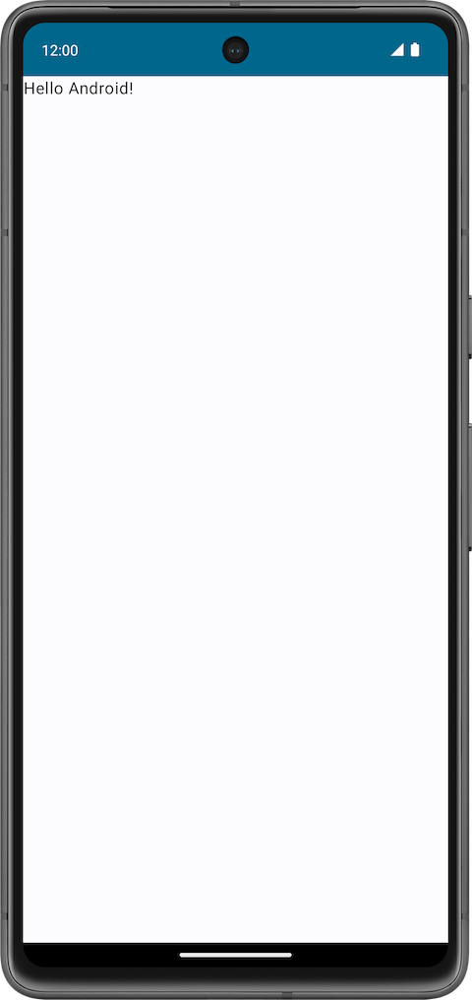
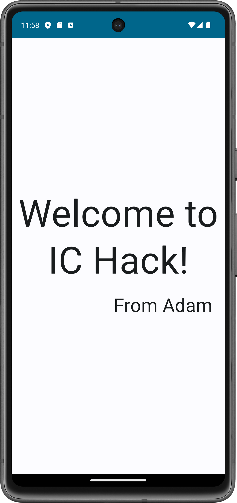
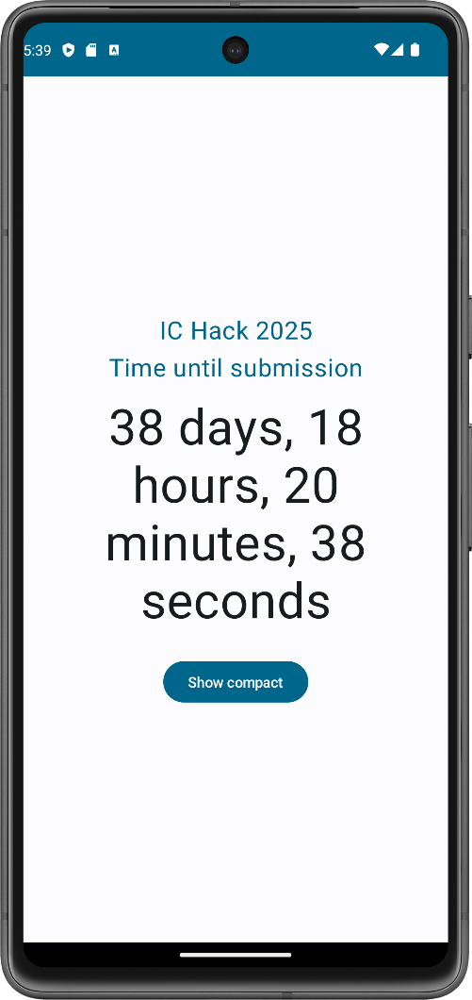
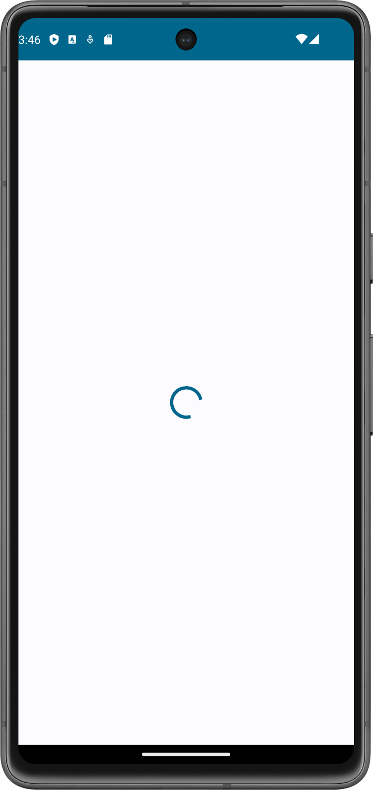
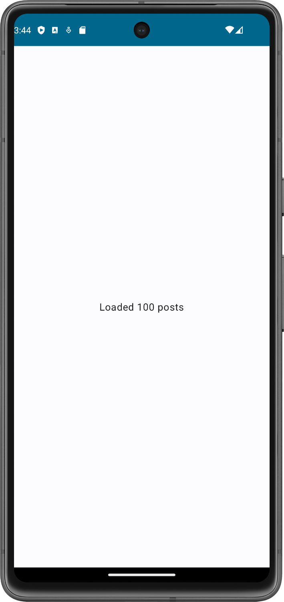
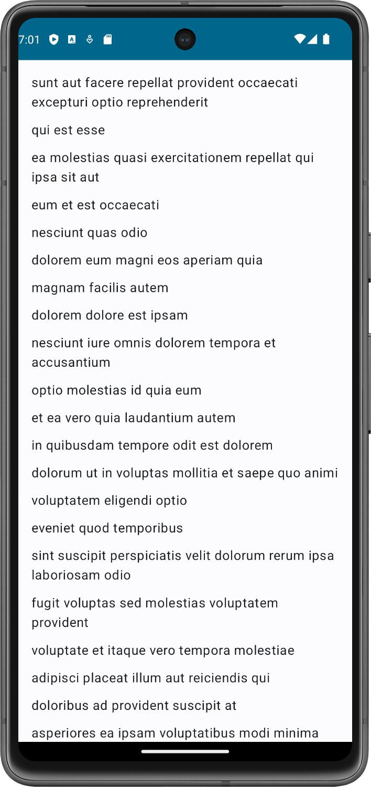
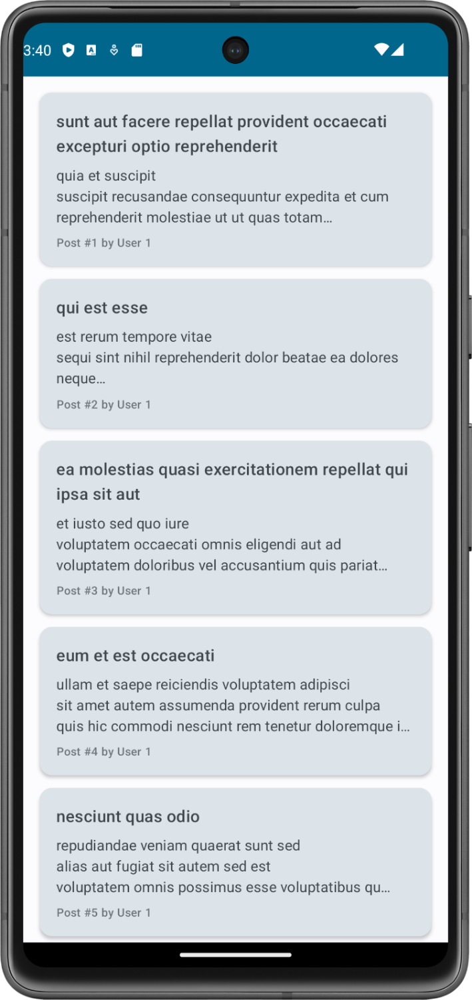

# Android Development with Kotlin

In this guide, we will cover the basics of Android development, using **Kotlin**, Google's preferred language for Android mobile development since 2019, and **Jetpack Compose**, Android's modern UI toolkit.

We will assume a basic working knowledge of Kotlin, and general object-oriented programming (OOP) concepts, but if you need some further guidance on this, don't worry! The [official Kotlin documentation](https://kotlinlang.org/docs/home.html) is a very useful tool.

To follow along, you'll probably also want to download **Android Studio**, the official IDE for Android app development. Use the [detailed installation instructions](https://developer.android.com/codelabs/basic-android-kotlin-compose-install-android-studio) for Windows, macOS, and Linux on the Android Developers website.

## Table of Contents

<!-- TOC -->

- [Android Development with Kotlin](#android-development-with-kotlin)
  - [Table of Contents](#table-of-contents)
  - [An IC Hack Greeting App](#an-ic-hack-greeting-app)
    - [Basic Set-up](#basic-set-up)
    - [Running on a physical device](#running-on-a-physical-device)
      - [Enabling Developer Options](#enabling-developer-options)
      - [Enabling USB Debugging](#enabling-usb-debugging)
      - [Connecting to your laptop](#connecting-to-your-laptop)
      - [Debugging with Logcat](#debugging-with-logcat)
    - [Understanding the generated code](#understanding-the-generated-code)
    - [Composable Functions](#composable-functions)
      - [Examples of composable functions](#examples-of-composable-functions)
      - [Layout Composables](#layout-composables)
      - [Units: dp and sp](#units-dp-and-sp)
      - [Modifiers: Styling and Layout](#modifiers-styling-and-layout)
      - [Step 1: Wrap your `Text` in a `Column`](#step-1-wrap-your-text-in-a-column)
      - [Step 2: Add a second `Text` for the "from" line](#step-2-add-a-second-text-for-the-from-line)
      - [Step 3: Update the function parameters](#step-3-update-the-function-parameters)
      - [Step 4: Style your text](#step-4-style-your-text)
      - [Step 5: Update your call sites](#step-5-update-your-call-sites)
      - [Step 6: Run your app](#step-6-run-your-app)
  - [An IC Hack Countdown Timer](#an-ic-hack-countdown-timer)
    - [Project Set-up](#project-set-up)
    - [State in Compose](#state-in-compose)
    - [Building the countdown display](#building-the-countdown-display)
    - [Making it tick with coroutines](#making-it-tick-with-coroutines)
    - [Formatting the time](#formatting-the-time)
    - [Adding a format toggle button](#adding-a-format-toggle-button)
    - [Setting a real target time](#setting-a-real-target-time)
    - [Handling the countdown end](#handling-the-countdown-end)
    - [Run your app](#run-your-app)
  - [Connecting to a Backend API](#connecting-to-a-backend-api)
    - [Project Set-up](#project-set-up-1)
      - [Adding dependencies](#adding-dependencies)
      - [Adding internet permissions](#adding-internet-permissions)
    - [Understanding the API](#understanding-the-api)
    - [Step 1: Define the data model](#step-1-define-the-data-model)
    - [Step 2: Create the HTTP client](#step-2-create-the-http-client)
    - [Step 3: Create a basic PostsScreen](#step-3-create-a-basic-postsscreen)
    - [Step 4: Add state for the posts](#step-4-add-state-for-the-posts)
    - [Step 5: Fetch the data](#step-5-fetch-the-data)
    - [Step 6: Show different UI based on state](#step-6-show-different-ui-based-on-state)
    - [Step 7: Display posts in a LazyColumn](#step-7-display-posts-in-a-lazycolumn)
    - [Step 8: Create a PostCard composable](#step-8-create-a-postcard-composable)
    - [Step 9: Wire it all together](#step-9-wire-it-all-together)
    - [Taking it further](#taking-it-further)
    - [Building your own backend](#building-your-own-backend)
  - [Next Steps](#next-steps)
    - [UI Design with Figma](#ui-design-with-figma)
    - [More on Coroutines](#more-on-coroutines)
    - [Working with Databases](#working-with-databases)
    - [Official Resources](#official-resources)

<!-- /TOC -->

## An IC Hack Greeting App

For our first demo, we'll build a simple app that allows us to greet IC Hack attendees!

It'll display a simple "Welcome to IC Hack!" message with a customisable tagline.

### Basic Set-up

Follow the instructions below to initialise the empty project we'll be able to build off:

- Open Android Studio.
- Create a new *Empty Activity* and name it how you like (I personally named my app 'Welcome to IC Hack'). An **Activity** represents a single screen in your app — we're creating an empty one to build from scratch.
- You can leave the other settings (*Minimum SDK*, *Build configuration language*) as the default.
- Once Android Studio has created and built your project, you should be able to click the green ▶️ *Run* button next to 'app' in the top toolbar. Your app should display as follows:



> [!WARNING]
> **Having trouble?** If Gradle sync fails or you see "No devices available", grab one of the mentors — they'll help you get set up!

### Running on a physical device

The Android emulator works great, but you can also run your app directly on your phone! This is often faster and lets you test real-world features like the camera or sensors.

#### Enabling Developer Options

First, you need to unlock Developer Options on your Android device:

1. Open **Settings** on your phone
2. Go to **About phone** (sometimes under **System**)
3. Find **Build number** and tap it **7 times** — you'll see a toast message saying "You are now a developer!"
4. Go back to Settings — you should now see **Developer options**

#### Enabling USB Debugging

1. Open **Developer options**
2. Find **USB debugging** and turn it on
3. Confirm the warning dialog

#### Connecting to your laptop

1. Plug your phone into your laptop with a USB cable
2. Your phone will show a prompt: "Allow USB debugging?" — tap **Allow** (you can tick "Always allow from this computer" for convenience)
3. In Android Studio, click the device dropdown next to the Run button — your phone should appear in the list
4. Select your phone and click Run!

> [!TIP]
> If your phone doesn't appear, try a different USB cable (some cables are charge-only), or check that you've accepted the debugging prompt on your phone.

#### Debugging with Logcat

When something goes wrong, **Logcat** is your best friend. It shows all the log messages from your app (and the system) in real-time.

To open Logcat, click **View → Tool Windows → Logcat** (or press `Alt+6`).

You can add your own log messages in code:

```kotlin
import android.util.Log

Log.d("MyApp", "Button was clicked!")  // Debug message
Log.e("MyApp", "Something went wrong: $error")  // Error message
```

Filter by your app's package name or search for your tag (like "MyApp") to find your messages among the noise.

### Understanding the generated code

Before we start making changes, let's understand what Android Studio created for us in `MainActivity.kt`:

- **`MainActivity`** is the entry point of your app — it's the Activity that runs when your app launches
- **`onCreate()`** is called when the Activity starts; think of it as your starting point
- **`setContent { }`** is where we define our UI using Compose
- **`WelcomeToICHackTheme { }`** wraps our content in a consistent theme (colours, typography, etc.)
- **`Surface`** is a container that applies the theme's background colour

Now let's talk about **composable functions**, the building blocks of your UI.

### Composable Functions

These are the basic building block of a UI in Jetpack Compose.

A composable function describes some part of your UI and is otherwise like any regular function in Kotlin, except for the fact that it doesn't return anything. Instead, it takes some input (its function parameters) and generates what's shown on the screen.

Composable functions are identified by the `@Composable` **annotation** before the function declaration. It informs the Compose compiler that this function is intended to convert data into UI.

#### Examples of composable functions

Take a look at the `MainActivity.kt` file in our generated project.

You should see two composable functions at the bottom: `Greeting()` and `GreetingPreview()`.

Both of these represent UI elements within our app, as desired: `Greeting()` encompasses a simple text box that displays a basic message, and `GreetingPreview()` uses the extra `@Preview` annotation to display this text box within a preview window in our IDE (which can be opened from the `Split` or `Design` views in the top-right).

Try toggling the `showBackground = true` parameter of the Preview annotation. You could even add `showSystemUI` and `name` parameters to customise your preview further.

---

Before we dive into the code further, we need to learn about a few more Compose concepts.

#### Layout Composables

So far, we've seen `Text()` — a composable that displays text on screen. But what if we want to display *multiple* pieces of text? And control how they're arranged?

This is where **layout composables** come in. These are special composables that don't display content themselves, but instead control how their *children* (the composables inside them) are positioned.

The three most common layout composables are:

- **`Column`**: arranges children vertically (stacked top to bottom)
- **`Row`**: arranges children horizontally (side by side)
- **`Box`**: stacks children on top of each other (like layers)

You can see these three layouts illustrated below.


For our greeting card, we want a main message at the top and a "from" line below it. This is a perfect use case for `Column`!

#### Units: dp and sp

When specifying sizes in Compose, we use special units that adapt to different screen densities:

- **`dp`** (density-independent pixels) — used for spacing, padding, and layout dimensions. A button that's `48.dp` wide will appear roughly the same physical size on any device.
- **`sp`** (scalable pixels) — used specifically for text sizes. These respect the user's font size preferences in their device settings, making your app more accessible.

#### Modifiers: Styling and Layout

You may have noticed that `Greeting()` has a `modifier` parameter. **Modifiers** are how we style and position composables in Jetpack Compose — think of them as a chain of instructions that describe how a composable should look and behave.

Modifiers can be chained together:

```kotlin
Modifier
    .padding(16.dp)       // Add space around the element
    .fillMaxWidth()       // Make it as wide as its parent
    .align(Alignment.End) // Position it to the right
```

Each modifier in the chain is applied in order, which can affect the result — for example, adding padding *before* a background colour gives a different effect than adding it *after*.

---

Now we're ready to update our code! We'll make these changes step by step.

> [!TIP]
> Android Studio should prompt you to add imports automatically as you type (just press `Alt+Enter` when you see a red underline).

#### Step 1: Wrap your `Text` in a `Column`

Find your `Greeting()` function. Currently it just contains a single `Text` composable. Wrap that `Text` inside a `Column { }` block:

```kotlin
Column {
    Text(
        text = "Hello $name!",
        modifier = modifier
    )
}
```

Remember, `Column` arranges its children vertically — so anything we add inside will stack top to bottom.

#### Step 2: Add a second `Text` for the "from" line

Inside your `Column`, after the first `Text`, add another `Text` composable. This one will display who the greeting is from. What text should it show? What parameters might you pass to it?

Try it yourself first, then check the example project if you get stuck!

#### Step 3: Update the function parameters

Currently `Greeting()` takes a `name` parameter, but now we want to display two different pieces of text: a message and a "from" line.

Update the function signature to take `message: String` and `from: String` instead of `name: String`. Then update your two `Text` composables to use these new parameters.

#### Step 4: Style your text

Plain text works, but let's make it look more like a greeting card! Try adding these parameters to your `Text` composables:

- `fontSize` — how large should your text be? Try something like `72.sp` for the main message and `36.sp` for the "from" line
- `lineHeight` — controls spacing when text wraps. Try `90.sp` for the main message
- `textAlign` — try `TextAlign.Center` for centred text

For the "from" text, can you use `Modifier.padding()` and `Modifier.align()` to add some spacing and push it to the right side?

#### Step 5: Update your call sites

Now that `Greeting()` has different parameters, you'll see errors where it's called. Update the call in `onCreate()` and in `GreetingPreview()` to pass your new `message` and `from` arguments.

What message do you want to display? Don't forget to add your own name!

#### Step 6: Run your app

Click *Run `app`* again in the top toolbar. You should now see your personalised IC Hack greeting displayed on screen!

Mine looks like this:



> [!TIP]
> **Stuck?** The complete example is available in the [`welcome-to-ic-hack`](/android-development/welcome-to-ic-hack/) directory. Compare your code to `MainActivity.kt` if you need a hint!

## An IC Hack Countdown Timer

For our second demo, we'll build a countdown timer that shows how long until IC Hack begins! This will introduce some more advanced concepts: **state management**, **coroutines**, and **interactive UI** with buttons.

### Project Set-up

Create a new *Empty Activity* project in Android Studio, just like before. I've named mine 'IC Hack Countdown'.

### State in Compose

So far, our greeting app has been entirely *static* — it displays the same thing every time. But a countdown timer needs to *change* over time. How do we make our UI update?

This is where **state** comes in.

**State** is any data that can change during the lifetime of your app. When state changes, Compose automatically **recomposes** (re-runs) the composables that use that state, updating the UI.

To create state in Compose, we use `remember` and `mutableStateOf`:

```kotlin
var count by remember { mutableStateOf(0) }
```

Let's break this down:

- **`mutableStateOf(0)`** creates a state holder with an initial value of `0`
- **`remember { }`** tells Compose to keep this value across recompositions (otherwise it would reset to `0` every time!)
- **`by`** is Kotlin's property delegation — it lets us read and write `count` directly instead of using `.value`

When you update `count`, any composable that reads it will automatically re-run with the new value. This is the core of Compose's reactive model!

### Building the countdown display

Let's start by creating a `CountdownTimer` composable. For now, we'll just display a title and a static time value:

```kotlin
@Composable
fun CountdownTimer(modifier: Modifier = Modifier) {
    var timeRemaining by remember { mutableStateOf(86400000L) } // 24 hours in milliseconds

    Column(
        horizontalAlignment = Alignment.CenterHorizontally,
        verticalArrangement = Arrangement.Center,
        modifier = modifier
            .fillMaxSize()
            .padding(24.dp)
    ) {
        Text(
            text = "IC Hack 2025\nTime until submission",
            textAlign = TextAlign.Center,
            fontSize = 24.sp,
            lineHeight = 36.sp,
            color = MaterialTheme.colorScheme.primary
        )

        Spacer(modifier = Modifier.height(8.dp))

        Text(
            text = formatTime(timeRemaining),
            fontSize = 48.sp,
            lineHeight = 56.sp,
            textAlign = TextAlign.Center
        )
    }
}
```

We're storing `timeRemaining` as a `Long` representing milliseconds. The title uses `MaterialTheme.colorScheme.primary` to pick up the theme's accent colour. We'll write the `formatTime()` helper function shortly.

Don't forget to update `onCreate()` to use your new `CountdownTimer` composable instead of `Greeting`!

### Making it tick with coroutines

Right now our timer just sits there. We need it to tick down every second!

**Coroutines** are Kotlin's way of writing asynchronous code — code that can pause and resume without blocking the main thread. In Compose, we use `LaunchedEffect` to run a coroutine when a composable enters the screen.

Add this inside your `CountdownTimer`, before the `Column`:

```kotlin
LaunchedEffect(Unit) {
    while (timeRemaining > 0) {
        delay(1000L) // Wait 1 second
        timeRemaining -= 1000L
    }
}
```

Here's what's happening:

- **`LaunchedEffect(Unit)`** starts a coroutine when the composable first appears. The `Unit` key means it only runs once.
- **`delay(1000L)`** pauses the coroutine for 1 second — *without* blocking the UI thread
- **`timeRemaining -= 1000L`** decreases the time, which triggers a recomposition

If you run your app now, you should see the time counting down!

### Formatting the time

We need a helper function to convert milliseconds into a readable format. Add this *outside* your composable (it's a regular function, not a composable):

```kotlin
fun formatTime(millis: Long, detailed: Boolean = true): String {
    val totalSeconds = millis / 1000
    val days = totalSeconds / 86400
    val hours = (totalSeconds % 86400) / 3600
    val minutes = (totalSeconds % 3600) / 60
    val seconds = totalSeconds % 60

    return if (detailed) {
        buildString {
            if (days > 0) append("$days days, ")
            if (hours > 0 || days > 0) append("$hours hours, ")
            append("$minutes minutes, $seconds seconds")
        }
    } else {
        String.format("%02d:%02d:%02d", hours + days * 24, minutes, seconds)
    }
}
```

This function supports two formats:

- **Detailed**: "2 days, 5 hours, 23 minutes, 47 seconds"
- **Compact**: "53:23:47"

We're passing a `detailed` parameter so we can toggle between them, but how can we actually introduce that toggling mechanism?

### Adding a format toggle button

Let's add a button that switches between the detailed and compact formats.

First, add another piece of state to track the current format:

```kotlin
var isDetailedFormat by remember { mutableStateOf(true) }
```

Then update your countdown `Text` to use this state:

```kotlin
Text(
    text = formatTime(timeRemaining, isDetailedFormat),
    fontSize = if (isDetailedFormat) 32.sp else 48.sp,
    lineHeight = if (isDetailedFormat) 44.sp else 56.sp,
    textAlign = TextAlign.Center
)
```

We adjust both `fontSize` and `lineHeight` based on the format — the detailed view needs more line spacing since it wraps across multiple lines.

Finally, add a `Button` below the text (but inside the `Column`):

```kotlin
Spacer(modifier = Modifier.height(24.dp))

Button(onClick = { isDetailedFormat = !isDetailedFormat }) {
    Text(if (isDetailedFormat) "Show compact" else "Show detailed")
}
```

The **`Spacer`** adds some breathing room between the countdown and the button.

The **`Button`** composable takes an `onClick` lambda — code that runs when the user taps it. Here, we're toggling `isDetailedFormat` between `true` and `false`.

### Setting a real target time

Instead of a hardcoded duration, let's count down to an actual date. Update your state initialisation:

```kotlin
// IC Hack 2025 submission time
val targetTime = 1769947200000L // February 1st, 12:00PM UTC

var timeRemaining by remember {
    mutableStateOf((targetTime - System.currentTimeMillis()).coerceAtLeast(0))
}
```

And update your `LaunchedEffect` to recalculate based on the current time:

```kotlin
LaunchedEffect(Unit) {
    while (timeRemaining > 0) {
        delay(1000L)
        timeRemaining = (targetTime - System.currentTimeMillis()).coerceAtLeast(0)
    }
}
```

The `.coerceAtLeast(0)` ensures we don't go negative if the target time has passed.

### Handling the countdown end

What happens when the countdown reaches zero? Let's show a celebration message!

Update your countdown `Text` to handle this case:

```kotlin
Text(
    text = if (timeRemaining > 0) {
        formatTime(timeRemaining, isDetailedFormat)
    } else {
        "🎉 IC Hack submission is closed!"
    },
    fontSize = if (timeRemaining <= 0 && isDetailedFormat) 32.sp else 48.sp,
    lineHeight = if (timeRemaining <= 0 && isDetailedFormat) 44.sp else 56.sp,
    textAlign = TextAlign.Center
)
```

The celebration message gets the smaller font size when detailed format is on, keeping it nicely contained.

You could also hide the format toggle button when the countdown is complete. Give this a try yourself!

### Run your app

Click *Run app* and you should see a live countdown with a working format toggle button.

Mine looks like this:



> [!TIP]
> **Stuck?** The complete example is available in the [`ic-hack-countdown`](/android-development/ic-hack-countdown/) directory.

## Connecting to a Backend API

Most hackathon projects need to fetch data from the internet. Let's build a third app that displays posts from an API — this will teach you how to make network requests, handle loading states, and display dynamic lists in Compose.

We'll use **[JSONPlaceholder](https://jsonplaceholder.typicode.com/)**, a free fake REST API that's perfect for prototyping. It provides endpoints like `/posts`, `/users`, and `/comments` with realistic sample data — no authentication or setup required!

### Project Set-up

Create a new *Empty Activity* project in Android Studio. I've named mine 'IC Hack Posts'.

#### Adding dependencies

We need to add two libraries to our project:

- **Ktor Client** — A Kotlin-first HTTP client from JetBrains
- **kotlinx.serialization** — For parsing JSON into Kotlin data classes

Open your **module-level** `build.gradle.kts` (the one inside the `app` folder) and add these dependencies inside the `dependencies { }` block:

```kotlin
// Ktor Client
implementation("io.ktor:ktor-client-android:2.3.7")
implementation("io.ktor:ktor-client-content-negotiation:2.3.7")
implementation("io.ktor:ktor-serialization-kotlinx-json:2.3.7")

// Serialization
implementation("org.jetbrains.kotlinx:kotlinx-serialization-json:1.6.2")
```

Also add the serialization plugin at the top of the same file, inside `plugins { }`:

```kotlin
id("org.jetbrains.kotlin.plugin.serialization") version "1.9.21"
```

Click **Sync Now** when Android Studio prompts you.

#### Adding internet permissions

Your app needs permission to access the internet. Open `AndroidManifest.xml` (in `app/src/main`) and add this line inside the `<manifest>` tag, before `<application>`:

```xml
<uses-permission android:name="android.permission.INTERNET" />
```

### Understanding the API

Before we write any code, let's understand what we're working with. Open your browser and visit **[https://jsonplaceholder.typicode.com/posts](https://jsonplaceholder.typicode.com/posts)**.

You'll see a JSON array containing 100 posts. Each post looks like this:

```json
{
    "userId": 1,
    "id": 1,
    "title": "sunt aut facere repellat provident...",
    "body": "quia et suscipit\nsuscipit recusandae..."
}
```

Our goal is to fetch this data and display it in a scrollable list. We'll build this up piece by piece.

### Step 1: Define the data model

To work with this JSON in Kotlin, we need a **data class** that matches its structure. Add this above your `MainActivity` class:

```kotlin
@Serializable
data class Post(
    val id: Int,
    val userId: Int,
    val title: String,
    val body: String
)
```

The `@Serializable` annotation tells `kotlinx.serialization` how to convert JSON to and from this class. You'll need to import it, so press `Alt+Shift+Enter` when you see the red underline.

### Step 2: Create the HTTP client

Now we need an HTTP client to make requests. Add this below your `Post` class:

```kotlin
val client = HttpClient(Android) {
    install(ContentNegotiation) {
        json(Json {
            ignoreUnknownKeys = true
        })
    }
}
```

This creates a Ktor client configured to automatically parse JSON responses. The `ignoreUnknownKeys = true` option means your app won't crash if the API adds new fields later.

Android Studio will show red underlines for the missing imports. Press `Alt+Shift+Enter` on each one, or add these at the top of your file:

```kotlin
import io.ktor.client.*
import io.ktor.client.call.*
import io.ktor.client.engine.android.*
import io.ktor.client.plugins.contentnegotiation.*
import io.ktor.client.request.*
import io.ktor.serialization.kotlinx.json.*
import kotlinx.serialization.json.Json
```

### Step 3: Create a basic PostsScreen

Let's start with a simple composable that just shows a loading indicator. Create a new composable function:

```kotlin
@Composable
fun PostsScreen(modifier: Modifier = Modifier) {
    Box(
        modifier = modifier.fillMaxSize(),
        contentAlignment = Alignment.Center
    ) {
        CircularProgressIndicator()
    }
}
```

Update your `onCreate()` to use this new composable instead of the default `Greeting`. Run your app — you should see a spinning progress indicator in the centre of the screen.



### Step 4: Add state for the posts

Now let's add state to hold our posts once they're fetched. Think back to the countdown timer — what pieces of state do we need here?

We need to track:

1. The list of posts (initially empty)
2. Whether we're still loading
3. Any error message (if something goes wrong)

Try adding these three state variables inside your `PostsScreen`, before the `Box`. What types should each one be?

<details>
<summary>Hint: <em>State declarations</em></summary>

```kotlin
var posts by remember { mutableStateOf<List<Post>>(emptyList()) }
var isLoading by remember { mutableStateOf(true) }
var errorMessage by remember { mutableStateOf<String?>(null) }
```

</details>

### Step 5: Fetch the data

Remember how we used `LaunchedEffect` to start the countdown timer? We'll use the same pattern here to fetch data when the screen appears.

Add a `LaunchedEffect` block before the `Box`. Inside it, you'll need to:

1. Make a GET request to `https://jsonplaceholder.typicode.com/posts`
2. Store the result in your `posts` state
3. Set `isLoading` to `false`
4. Handle any exceptions by setting `errorMessage`

The Ktor syntax for a GET request looks like this:

```kotlin
val result: List<Post> = client.get("https://...").body()
```

Try implementing the `LaunchedEffect` yourself, using a `try/catch` block to handle errors.

<details>
<summary>Hint: <em>LaunchedEffect implementation</em></summary>

```kotlin
LaunchedEffect(Unit) {
    try {
        posts = client.get("https://jsonplaceholder.typicode.com/posts").body()
        isLoading = false
    } catch (e: Exception) {
        errorMessage = "Failed to load posts: ${e.message}"
        isLoading = false
    }
}
```

</details>

### Step 6: Show different UI based on state

Right now we always show the loading spinner. Update your `Box` content to show different UI depending on the state:

- If `isLoading` is true → show `CircularProgressIndicator()`
- If `errorMessage` is not null → show the error in a `Text` composable
- Otherwise → show the posts (we'll build this next)

A `when` expression works well here. For now, just display `Text("Loaded ${posts.size} posts")` in the success case — we'll make it prettier shortly.

Run your app. After a brief loading spinner, you should see "Loaded 100 posts"!



### Step 7: Display posts in a LazyColumn

Now for the fun part: **displaying the actual posts**. `LazyColumn` is Compose's scrollable list component. Unlike a regular `Column`, it only renders the items currently visible on screen, making it efficient for long lists.

Create a new composable to display the list:

```kotlin
@Composable
fun PostsList(posts: List<Post>) {
    LazyColumn(
        contentPadding = PaddingValues(16.dp),
        verticalArrangement = Arrangement.spacedBy(12.dp)
    ) {
        items(posts) { post ->
            // We'll create PostCard next
            Text(post.title)
        }
    }
}
```

Update your `PostsScreen` to call `PostsList(posts = posts)` in the success case.

Run the app. You should see a list of post titles! Try scrolling through them.



> [!NOTE]
> In the Android emulator, there's no visible scrollbar. Just click and drag anywhere on the list to scroll, like you would on a real phone.

### Step 8: Create a PostCard composable

Plain text works, but let's make each post look like a proper card. Create a `PostCard` composable that takes a single `Post` and displays it nicely.

Think about what you want to show:

- The post title (prominent, maybe 2 lines max)
- The post body (smaller, maybe 3 lines max)
- Some metadata like "Post #1 by User 1"

Try using:

- `Card` with `CardDefaults.cardElevation()` for a nice shadow effect
- `MaterialTheme.typography.titleMedium` and `bodyMedium` for text styles
- `TextOverflow.Ellipsis` with `maxLines` to truncate long text
- `Spacer` for spacing between elements

Build this yourself, then check the [example project implementation](/android-development/ic-hack-posts/app/src/main/java/com/example/ichackposts/MainActivity.kt) if you need guidance!

### Step 9: Wire it all together

Update your `PostsList` to use `PostCard(post = post)` instead of the plain `Text`.

Run your app one final time. You should see:

1. A loading spinner briefly
2. A scrollable list of nicely-formatted post cards
3. If you turn off your internet and restart, an error message

Congratulations! You've built an app that fetches and displays data from a real API!



> [!TIP]
> **Stuck?** The complete example is available in the [`ic-hack-posts`](/android-development/ic-hack-posts/) directory. Compare your code to `MainActivity.kt` if you need a hint!

### Taking it further

Here are some ideas to extend this example:

- **Add pull-to-refresh** using `PullToRefreshBox` from Material 3
- **Navigate to a detail screen** when a post is tapped (look into Compose Navigation)
- **Add a search bar** to filter posts by title
- **Create a new post** using `client.post()` — JSONPlaceholder accepts POST requests and returns the created object (though it won't actually persist)

### Building your own backend

Want to connect to your own API instead? Check out the **[API Design HackPack](../api-design/README.md)** which covers:

- Building REST APIs with **FastAPI** (Python)
- Serverless functions with **Firebase Cloud Functions**
- Best practices for API design at hackathons

The FastAPI example in that HackPack creates a `/posts` endpoint — you could run it locally and point your Android app at `http://10.0.2.2:8000/posts` (that's how the Android emulator reaches your host machine's localhost).

## Next Steps

Congratulations — you've built three Android apps and learned the fundamentals of Jetpack Compose! Here are some directions you could explore next.

### UI Design with Figma

If you're working with a designer (or wearing that hat yourself), you'll want to translate visual designs into Compose code:

- **[Figma Dev Mode](https://www.figma.com/dev-mode/)** — Inspect designs and extract spacing, colours, and typography values to implement in Compose.
- **[Material Theme Builder](https://m3.material.io/theme-builder)** — Create a custom colour scheme and export it as Compose theme code. This generates the `Color.kt`, `Theme.kt`, and `Type.kt` files for your project.

### More on Coroutines

We only scratched the surface with `LaunchedEffect` and `delay()`. Kotlin Coroutines are a powerful tool for handling asynchronous operations:

- **`suspend` functions** — Functions that can pause and resume, perfect for network calls or database operations
- **`CoroutineScope`** and `viewModelScope` — Managing coroutine lifecycles properly
- **`Flow`** — Reactive streams of data that emit values over time (great for real-time updates)
- **Structured concurrency** — Running multiple coroutines in parallel with `async`/`await`

Resources:

- [Kotlin Coroutines Guide](https://kotlinlang.org/docs/coroutines-guide.html)
- [Coroutines in Android](https://developer.android.com/kotlin/coroutines)

### Working with Databases

For local data persistence, Android offers several options:

- **[Room](https://developer.android.com/training/data-storage/room)** — A SQLite abstraction that provides compile-time query verification and works seamlessly with coroutines and Flow
- **[DataStore](https://developer.android.com/topic/libraries/architecture/datastore)** — A modern replacement for SharedPreferences, great for storing user preferences
- **[Firebase](https://firebase.google.com/docs/android/setup)** — Cloud-hosted database (Firestore or Realtime Database) with real-time sync and offline support

### Official Resources

- **[Android Basics with Compose](https://developer.android.com/courses/android-basics-compose/course)** — Google's free course covering everything from basics to advanced topics
- **[Jetpack Compose Samples](https://github.com/android/compose-samples)** — Official sample apps demonstrating various Compose patterns
- **[Now in Android](https://github.com/android/nowinandroid)** — A fully-featured sample app showcasing modern Android development best practices

Good luck with your project!
