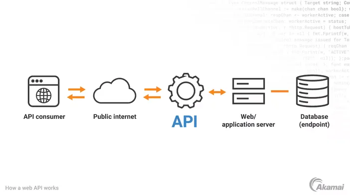

# API Design

Modern applications are built around **APIs**. A well-designed API is easy to understand, hard to misuse, evolvable and performant under load.

*Since we are in a hackathon, the goal is speed, correctness and maximum simplicity, not long-term perfection!*

In this HackPack, we will focus on creating an API that is

- Easy to wire up
- Hard to accidentally break
- "Good enough" to demonstrate your ideas

This HackPack will cover

 1. General API Design
 2. Firebase Cloud Functions for serverless APIs
 3. FastAPI (Python) for fast iteration and typed safety

Example code will be provided, with more info [found here](#example-code).

It may be a good idea to first familiarise yourself with databases, since a lot of what APIs do is working with persistent data. [Click here to find out more](../databases/README.md)

# Table Of Contents

- [API Design](#api-design)
- [Table Of Contents](#table-of-contents)
- [General API Design](#general-api-design)
  - [What Is an API?](#what-is-an-api)
  - [REST and HTTP](#rest-and-http)
  - [Resources and URLs](#resources-and-urls)
  - [HTTP Methods](#http-methods)
    - [Glossary](#glossary)
    - [GET](#get)
    - [OPTIONS](#options)
    - [POST](#post)
    - [PUT](#put)
    - [PATCH](#patch)
    - [DELETE](#delete)
  - [Status Codes](#status-codes)
  - [Request and Response Bodies](#request-and-response-bodies)
  - [Authentication and Authorisation](#authentication-and-authorisation)
  - [Error Handling](#error-handling)
  - [Extras](#extras)
    - [Rate Limiting](#rate-limiting)
    - [Pagination](#pagination)
    - [Caching](#caching)
    - [Versioning](#versioning)
  - [General Rules](#general-rules)
  - [Common Failures](#common-failures)
  - [Cheatsheet](#cheatsheet)
- [Making Requests](#making-requests)
  - [JavaScript/TypeScript](#javascripttypescript)
- [Secrets](#secrets)
  - [Python](#python)
  - [Vite](#vite)
  - [JS/TS](#jsts)
- [Creating Your Own Backend](#creating-your-own-backend)
  - [Firebase Cloud Functions](#firebase-cloud-functions)
  - [FastAPI](#fastapi)
- [Example Code](#example-code)

# General API Design

## What Is an API?

An **Application Programming Interface** is the definition of a contract between a client and a server.

It defines the **inputs**, consisting of the request method, URL, headers and body. The **outputs** are also defined, with a status code, headers and body.

An API should be treated as a black box, with the client not caring *how* the backend server is implemented, only that it obeys this contract.



## REST and HTTP

Most modern APIs are **RESTful** and built on HTTP.

- Everything is a **resource**
- Resources are identified by **URLs**
- Operations are expressed via **HTTP methods**
- State is transferred using **representations** (JSON)

REST is a *design style*, not a protocol. You should follow REST conventions where they help clarity and speed, and ignore them when they slow you down.

## Resources and URLs

We design URLs around **nouns** not verbs.

URLs should show a hierarchy, reflecting ownership or containment.

- `/users/{id}/posts` are the posts owned by a user
- `/posts/{id}/comments` are the comments belonging to a post

***The GOOD:***

```bash
GET /users
GET /users/{userId}
POST /posts
GET /posts/{postId}/comments
```

**Why?**

- Nouns, not verbs
- Predictable and consistent, you can guess how to interact with the API even without documentation
- Hierarchical structure. `/posts/{postId}/comments` clearly shows that comments belong to a post
- Follows standard REST conventions: URLs represent entities, HTTP methods represent actions

***The BAD:***

```bash
GET /getUsers
POST /createPost
POST /deleteComment
```

**Why?**

- Mixing verbs and nouns: `GET /getUsers` is redundant, since `GET` already implies that we are fetching
- Inconsistent naming- you may end up confusing endpoints like `POST /createPost` and `POST /addPost`, two verbs for the same action

***The UGLY:***

```bash
DELETE /getUsers
GET /incrementCounter
PATCH /deletePost
```

**Why?**

- HTTP method conflicts with verb in URL
- Very hard to maintain, you will struggle to guess what an endpoint does  

>[!WARNING]
>The BAD section would at least work and make sense, ***NEVER*** do anything from the UGLY!

## HTTP Methods

The subsections below after the glossary show the HTTP methods that you can use for your API.

For the examples provided for each of the HTTP methods, we will be using an in-memory 'database'

```py
users = {}
```

Our 'database' will store users, with documents having the following schema

```py
class User(BaseModel):
    name: str
    email: str
```

### Glossary

**Safe:** Does not change server state

**Server state:** Anything persistent or observable:

- database rows
- counters
- logs
- "last viewed" timestamps
- cache entries

**Idempotent:** Repeated calls do not change the result

**Cacheable:** Intermediaries can cache the result

### GET

**Semantics**

- Safe
- Idempotent
- Cacheable

**What GET must not do**

- Modify database state
- Increment counters
- Trigger any side effects
- Create audit events that affect behaviour

>[!NOTE]
>It’s acceptable to use logging for debugging purposes, but nothing should be user-visible or persisted.

**What GET can do**

- Read data
- Filter via query parameters
- Pagination
- Sorting

**Example**

```py
@app.get("/users/{user_id}")
def get_user(user_id: int):
    if user_id not in users:
        raise HTTPException(status_code=404, detail="User not found")
    return users[user_id]
```

As you can see, the above `GET` API call would retrieve a user based on the `user_id` of the resource.

---

### OPTIONS

**Semantics**

- Safe
- Idempotent
- Can be Cacheable

**Purpose**

Returns the allowed methods and CORS info. This will likely be automatically handled for you by FastAPI and Firebase Cloud Functions.

>[!WARNING]
>Since these are automatically handled, don't use this

>[!TIP]
>If you are having problems with this, ask a mentor on the day for help!

---

### POST

**Semantics**

- Not safe
- Not idempotent
- Not cacheable

**Purpose**

`POST` can do pretty much any action or side-effect, such as:

- Create resources
- Trigger actions
- Perform non-idempotent operations
- Accept complex input

**Typical uses**

```bash
POST /posts    # create
POST /login    # auth
POST /posts/123/like
POST /search   # complex queries
```

**What POST does *not* guarantee**

Since POST is not idempotent, if POST is retried, side effects may repeat.

>[!WARNING]
>You may be tempted to use POST for most API operations. Try to limit its use and use the other HTTP methods where possible.

>[!TIP]
>Treat this as a *'do anything'* method

**Example**

```py
@app.post("/users", status_code=201)
def create_user(user_id: int, user: User):
    if user_id in users:
        raise HTTPException(status_code=400, detail="User already exists")
    users[user_id] = user
    return user
```

The above example creates a new `user` entry in our database given a `user_id` and a `user` document.

---

### PUT

**Semantics**

- Not Safe
- Idempotent
- Not Cacheable

**Purpose**

This is used for replacing the entire resource with the provided representation.

This will replace the resource with the data provided by the headers and body by the client.

**Rules**

- The client supplies the full resource state
- Server completely overwrites existing state
- Repeating PUT results in the same final state

>[!WARNING]
>A common point of failure is using PUT for partial updates
>Using `PUT` for partial updates can overwrite fields you didn’t intend to change. Use `PATCH` for updating just specific fields.

**Example**

```py
@app.put("/users/{user_id}")
def replace_user(user_id: int, user: User):
    if user_id not in users:
        raise HTTPException(status_code=404, detail="User not found")
    users[user_id] = user  # Replaces the entire user object
    return user
```

This looks very similar to `POST`, however this isn't creating a new resource, instead it is replacing the resource with new data: a new `user`. This will override all the fields.

---

### PATCH

**Semantics**

- Not Safe
- Can be Idempotent
- Not Cacheable

**Purpose**

Whereas PUT replaces the whole resource, PATCH partially modifies the resource with the provided data.

**Idempotence**

Depending on the implementation, PATCH may or may not be idempotent

- `set name = "Alice"` is idempotent
- `increment likes by 1` is not idempotent

**Example**

```py
@app.patch("/users/{user_id}")
def update_user(user_id: int, user: dict):
    if user_id not in users:
        raise HTTPException(status_code=404, detail="User not found")
    # Update only the provided fields
    updated = users[user_id].dict()
    updated.update(user)
    users[user_id] = User(**updated)
    return users[user_id]
```

Like `PUT`, but only the supplied fields are updated. Missing fields remain unchanged.

---

### DELETE

**Semantics**

- Not Safe
- Idempotent
- Not Cacheable

**Rules**

- Repeating DELETE should not change the state (after the first call anyway)
- Subsequent calls should return errors

**Example**

```py
@app.delete("/users/{user_id}")
def delete_user(user_id: int):
    if user_id not in users:
        raise HTTPException(status_code=404, detail="User not found")
    del users[user_id]
    return {"detail": "User deleted"}
```

The above code does as we expect, deletes a user with the given `user_id`, if they exist.

---

## Status Codes

Status codes are a key part of an API contract.

Common ones:

- `200 OK` - successful request
- `201 Created` - resource created
- `204 No Content` - success, no body
- `400 Bad Request` - client error
- `401 Unauthorised` - missing/invalid auth
- `403 Forbidden` - authenticated but not allowed
- `404 Not Found` - resource does not exist
- `409 Conflict` - constraint violation
- `500 Internal Server Error` - server bug

---

## Request and Response Bodies

We use JSON as the format for passing data between the client and the backend.

>[!TIP]
>Choose a JSON schema and stick with it. Document it too!

Example response:

```JS
{
    "id": "123",
    "authorId": "abc",
    "text": "Hello",
    "createdAt": "2025-12-18T14:27:01Z",
}
```

**Rules of thumb:**

- Always return the created resource on `POST`
- Use ISO-8601 for timestamps
- Prefer explicit fields over positional arrays

---

## Authentication and Authorisation

Authentication verifies the user, and authorisation verifies what a user can do.

The common mechanisms include:

- API keys (simple)
- OAuth2 / JWT (industry standard)
- Session cookies (web apps)

This is pretty straightforward for Cloud Functions since Firebase already includes Auth.

>[!TIP]
>Anonymous auth or hardcoded users are acceptable for a hackathon.

---

## Error Handling

Errors should be:

- Machine-readable
- Consistent

Example:

```JS
{
    "error": "permission_denied",
    "message": "You cannot delete this post"
}
```

The key is simplicity and consistency.

---

## Extras

The following are good practice in production but not necessary for hackathons!

### Rate Limiting

This should be done to prevent abuse. This adds unnecesarry complexity in a hackathon setting where you do not have real clients.

### Pagination

Returning all the results can unnecesarily use up both server and client resources. You will be unlikely to have enough data to require this in a hackathon setting.

### Caching

Improves request latency, but not worth it in a hackathon setting. This is already provided for you by Firebase.

### Versioning

Since APIs evolve, we need versioning so clients don't break when we change contracts.

Common strategies:

- URL versioning: `/v1/posts`
- Header versioning: `Accept: application/vnd.myapi.v1+json`

Since you are not in a production setting, you can quickly migrate anything, so this shouldn't be needed.

---

## General Rules

- **GET**, **HEAD** and **OPTIONS** should **NEVER** have any side effects or unsafe actions.
- Use of verbs
- Inconsistent request and response shapes
- Returning HTML
- Silent failures

---

## Common Failures

| Rule                         | What can go wrong if broken                           |
| ---------------------------- | ----------------------------------------------------- |
| GET modifies state           | Duplicate writes from prefetch, crawlers, retries     |
| POST is used for reads       | Hard to cache, confusing for clients                  |
| Inconsistent response shapes | Frontend bugs and unnecessary type-checking headaches |
| DELETE non-idempotent        | Double deletions break demo logic                     |
| Ignoring timestamps/IDs      | Hard to display ordered lists, detect duplicates      |

---

## Cheatsheet

| Method  | Safe | Idempotent | Typical Use       | Notes                                      |
| ------- | ---- | ---------- | ----------------- | ------------------------------------------ |
| GET     | ✅   | ✅         | Read resources    | Never mutate state                         |
| POST    | ❌   | ❌         | Create / actions  | Non-repeatable by default                  |
| PUT     | ❌   | ✅         | Replace resource  | Full replacement, not partial              |
| PATCH   | ❌   | ⚠️         | Partial update    | Can break idempotence if not careful       |
| DELETE  | ❌   | ✅         | Delete resource   | Repeating should not fail catastrophically |
| HEAD    | ✅   | ✅         | Metadata / checks | Usually ignored                            |
| OPTIONS | ✅   | ✅         | CORS info         | Framework handles                          |

# Making Requests

Since all backends are HTTP requests, there is a unified way to create a request from a frontend.

Below are the links to the guides on how to call our API functions, from the respective frontend HackPacks.

## JavaScript/TypeScript

```ts
const res = await fetch(url, {
    method: "GET",
    headers: { "Content-Type": "application/json" },
    body: JSON.stringify(data),
  });
```

The above code demonstrates how to create and send a request in `JS` and `TS`. Note that all the extra arguments like `method`, `headers`, `body` are optional. Below are the defaults.

| Option      | Default                    |
| ----------- | -------------------------- |
| method      | `"GET"`                    |
| headers     | `{}`                       |
| body        | `null`                     |

>[!IMPORTANT]
> Since HTTP requests use the network and are waiting for a response, they are **asynchronous**. This requires the `async` keyword and requires the function calling them to be `async` as well.

Of course there may be errors with the request, so your frontend will need to adequately handle this. An example is shown below for simple error throwing.

```ts
if (!res.ok) {
    const errText = await res.text();
    throw new Error(`HTTP ${res.status}: ${errText}`);
}
```

You can unpack the response data with

```ts
const data = await res.json();
```

The only error that can occur with the request itself is a network error. This should be handled by wrapping the request in a `try ... catch ...` block, like below

```ts
export async function createPost(text: string) {
  try {
    const res = await fetch(API, {
      method: "POST",
      headers: { "Content-Type": "application/json" },
      body: JSON.stringify({ text }),
    });

    if (!res.ok) {
      const errText = await res.text();
      throw new Error(`HTTP ${res.status}: ${errText}`);
    }
    return res.json();
  } catch (err) {
    throw new Error("Network Error");
  }
}
```

The above demonstrates a full HTTP request with full error handling.

You can use this as a function in your React or Vue app.

[**Android**](../android-development/README.md#connecting-to-a-backend-api)

# Secrets

Unless you are using Firebase (which has its own user authentication and deployment system), you will likely need to store some sensitive API keys.

You do ***not*** want to be publishing them on a public platform. The best way to handle this is to create a local `.env` file in the root of your backend.

Since we do not want this file to be pushed to GitHub, you will want to add it to your `.gitignore`. [Click here for more information about Git and `.gitignore`](../git-&-github/README.md#gitignore)

Your `.env` file may look something like this

```txt
DB_HOST=localhost
DB_PORT=5432
SECRET_KEY=supersecret
```

where the left hand side are the names of the environment variables, and the right hand side the value.

## Python

For Python, you will first need to install the `python-dotenv` library to your virtual environment. First, complete up to [Step 3 of the FastAPI setup guide](#setup-1).

Run

```bash
pip install python-dotenv
```

Now, wherever you need to access those environment variables, add this to the top of that file

```py
from dotenv import load_dotenv
import os

load_dotenv()
host = os.getenv("DB_HOST")
```

where `DB_HOST` is the name of the environment variable we want.

## Vite

If you have created your JS/TS project using Vite, there is an easy way to extract environment variables.

Any environment variables in your `.env` file must first be prefixed with `VITE_` to make them available.

```txt
VITE_DB_HOST=localhost
VITE_DB_PORT=5432
VITE_SECRET_KEY=supersecret
```

Unlike Python, you do not need to import or install any modules. Simply use

```JS
const host = import.meta.env.VITE_DB_HOST;
```

## JS/TS

Follow these instructions if you did not use Vite as your build tool.

In your backend root, first run

```bash
npm i dotenv
```

to install the `dotenv` package to your project.

Wherever you need your environment variable, use

```ts
import 'dotenv/config';

const host = process.env.DB_HOST;
```

# Creating Your Own Backend

The two backends we will be covering are **Firebase** and **FastAPI**. 

## Firebase Cloud Functions

**Pros:**

- Faster to deploy: no self-hosting needed, deployment in minutes
- Excellent integration with Firebase services: databases, authentication

**Cons:**

- Deploy cycles are slower: local deployment is very fast once set up

You would use this if you are using **Firestore** as your database, and are comfortable with JS/TS. Also use if you are not too comfortable with self-deploying an application.

[Click here to go to the full Firebase HackPack](./Firebase.md)

## FastAPI

**Pros:**

- It's Python!!
- Very fast iteration: startup time is extremely fast
- Freedom: you can use any service or database

**Cons:**

- You have to self-host: fine for ICHack, but a small bump to get over first
- More manual setup than Firebase
- Authentication is much more difficult to implement

You would use **FastAPI** if you are comfortable with Python, are using machine learning (since Python ML integration is amazing), or want maximum flexibility.

[Click here to go to the full FastAPI HackPack](./FastAPI.md)

# Example Code

Since an API is a contract between a frontend and backend, with no implementation details being necessary, the example code is split into the frontend, and the backends.

The frontend code, [found here](./example-project/frontend/), can swap between the Firebase and FastAPI backends just by [changing the API URL](./example-project/frontend/src/classic_api.ts#1). You can further choose between the Firebase API implementations by [changing the imported middleware](./example-project/frontend/src/App.tsx#3)

[See here for more information about Firestore and document databases](../databases/document.md)
[See here for more information abour databases in general](../databases/README.md)