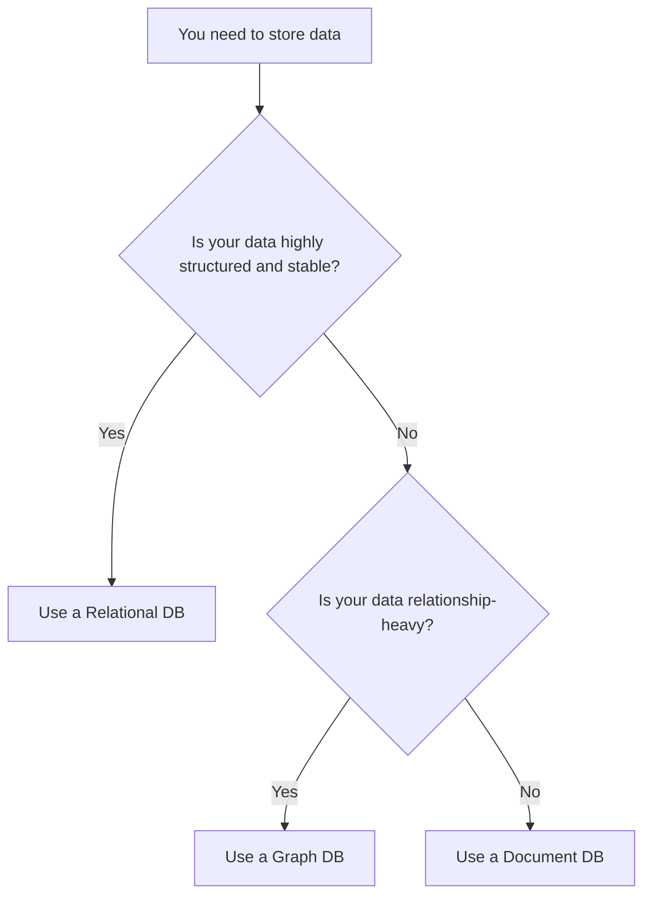

# Databases

For your ICHack project, you will almost certainly need to store data. This HackPack gives a **high-level** overview of the main database paradigms you are likely to use, and how to choose between them.

We have deep dives into 3 types:

 - [Structured (Relational) Databases - PostgreSQL]()
 - [Document Databases - Firestore](document.md)
 - [Graph Databases - [NOT SURE]]()

Use the decision tree below to choose your database.
  

## A Deeper Dive

### Structured/Relational Databases

Relational databases store data in **tables with fixed schemas**, with rows and columns. Relationships between entities are expressed using **foreign keys**.

#### Key properties

- Strong, explicit schema
- ACID transactions
- Powerful querying via SQL
- Referential integrity guarantees
  
#### Pros/Cons

✅ Clear, stable data structure \
✅ Complex queries and joins supported \
✅ Strong consistency and reliability \
❌ Schema changes require migrations \
❌ Less flexible for rapidly evolving data

#### Example use cases

- User accounts and auth
- Financial data
- Inventory
- Leaderboards

[Click here for the deep-dive.]()

---

### Document Databases

Document databases store data as **JSON-like documents**. Each document can have a flexible, decentralised structure.

#### Key properties

- Schema-flexible
- Documents are often denormalised
- Easy to map directly to application objects
- Supports nested data structures
  
#### Pros/Cons

✅ Rapid prototyping \
✅ Flexible and evolving data structures \
✅ Naturally hierarchical or nested data \
❌ More limited queries than SQL \
❌ Joins are complex

#### Example use cases

- User profiles with optional fields
- Content platforms (posts, comments)
- Logs, events and analytics
- Chat apps
  
[Click here for the deep-dive](document.md)

### Graph Databases

Graph databases model data as **nodes** (entities) and **edges** (relationships).

#### Key Properties

- Explicit relationship modelling
- Efficient traversal of deep connections
- Query languages based on graph patterns

#### Pros/Cons

✅ Excellent for relationship-heavy data \
✅ Fast traversal for complex connections \
✅ Queries like "friends of friends" or "shortest path" are efficient \
❌ Overkill for simple or tabular data \
❌ Can be harder to integrate with traditional apps

#### Example use cases

- Social networks
- Recommendation systems
- Dependency graphs
- Knowledge graphs

[Click here for the deep-dive]()
