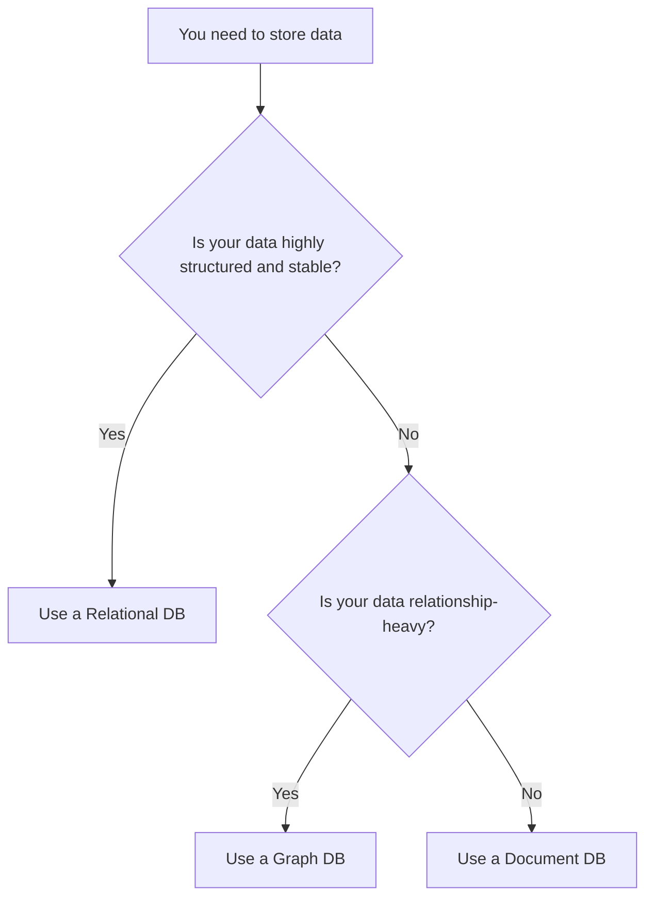

# Databases

For your IC Hack project, you will almost certainly need to store data. This HackPack gives a **high-level** overview of the main database paradigms you are likely to use, and how to choose between them.

We have deep dives into two common types of databases:

- [**Structured (Relational) Databases - PostgreSQL**]()
- [**Document Databases - Firestore**](document.md)

Furthermore, we also mention a third type: **Graph Databases**, in passing, even if there is no dedicated HackPack for them.

Use the decision tree below to choose your database.

```mermaid
flowchart TD
    A[You need to store data] --> B{Is your data highly structured and stable?}


    B -->|Yes| C[Use a Relational DB]
    B -->|No| D{Is your data relationship-heavy?}

    D -->|Yes| E[Use a Graph DB]
    D -->|No| F[Use a Document DB]
```

## Table of Contents
<!-- TOC -->

- [Databases](#databases)
  - [Table of Contents](#table-of-contents)
  - [Structured/Relational Databases](#structuredrelational-databases)
    - [Key properties](#key-properties)
    - [Pros/Cons](#proscons)
    - [Example use cases](#example-use-cases)
  - [Document Databases](#document-databases)
    - [Key properties](#key-properties-1)
    - [Pros/Cons](#proscons-1)
    - [Example use cases](#example-use-cases-1)
  - [Graph Databases](#graph-databases)
    - [Key Properties](#key-properties-2)
      - [Pros/Cons](#proscons-2)
      - [Example use cases](#example-use-cases-2)
      - [Useful links](#useful-links)

<!-- /TOC -->

## Structured/Relational Databases

Relational databases store data in **tables with fixed schemas**, with rows and columns. Tables have **primary keys** comprising one or several columns, that uniquely identify a row. Relationships between entities are expressed using **foreign keys**: columns whose values must reference an existing **primary key** in another (or same) table. This enforces **referential integrity**, meaning the database prevents references to non-existent rows and keeps related data consistent.

### Key properties

- Strong, explicit schema
- ACID transactions (safe, reliable updates despite failures and concurrent access)
- Powerful querying via SQL
- Referential integrity guarantees

### Pros/Cons

✅ Clear, stable data structure \
✅ Complex queries and joins supported \
✅ Strong consistency and reliability \
❌ Schema changes require migrations, making rapid schema evolution cumbersome

### Example use cases

- User accounts and auth
- Financial data
- Inventory
- Leaderboards

[Read more about relational databases in their dedicated HackPack]().

## Document Databases

Document databases store data as **JSON-like documents**. Each document can have a flexible, decentralised structure. Relationships are typically represnted by embedding related data within a document, or by storing references, rather than using joins.

### Key properties

- Schema-flexible
- Documents are often denormalised, storing related data together to optimise reads but increasing redundancy
- Easy to map directly to application objects
- Supports nested data structures

### Pros/Cons

✅ Rapid prototyping \
✅ Flexible and evolving data structures \
✅ Naturally hierarchical or nested data \
❌ More limited queries than SQL \
❌ Joins are complex

### Example use cases

- User profiles with optional fields
- Content platforms (posts, comments)
- Logs, events and analytics
- Chat apps

[Read more about document databases in their dedicated HackPack](document.md).

## Graph Databases

Graph databases model data as **nodes** (entities) and **edges** (relationships).

### Key Properties

- Explicit relationship modelling
- Efficient traversal of deep connections
- Queries expressed as traversals and subgraph patterns

#### Pros/Cons

✅ Excellent for relationship-heavy data \
✅ Fast traversal for complex connections \
✅ Queries like "friends of friends" or "shortest path" are efficient \
❌ Overkill for simple or tabular data \
❌ Can be harder to integrate with traditional apps

#### Example use cases

- Social networks
- Recommendation systems
- Dependency graphs
- Knowledge graphs

#### Useful links

If you'd like to learn more about graph databases or use them in your project, we'd recommend reading through [the Neo4j docs](https://neo4j.com/docs/getting-started/graph-database/) or checking out [Amazon Neptune](https://aws.amazon.com/nosql/graph/).

You can always speak to a coach, as well!
