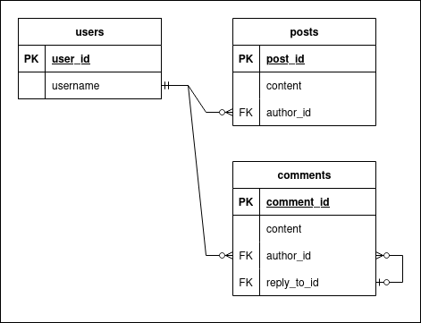

# Relational databases and PostgreSQL

## Table of Contents

<!-- TOC -->

- [Relational databases and PostgreSQL](#relational-databases-and-postgresql)
  - [Table of Contents](#table-of-contents)
  - [Relational databases](#relational-databases)
    - [Primary keys](#primary-keys)
    - [Foreign Keys](#foreign-keys)
  - [PostgreSQL](#postgresql)
    - [ORMs](#orms)

<!-- /TOC -->

## Relational databases

**Relational databases** are databases based upon [a specific model](https://en.wikipedia.org/wiki/Relational_model) of storing data, where data is represented by tuples (groups of values of fixed size, more commonly referred to as rows or records) within relations (more commonly known as tables). A table organises data into columns with titles and data types, and each row contains an entry (which may be `NULL`) for each column. Basically, relational databases are made up of many tables, each with a fixed number of columns, and with each entry in said table (each row) being one data-point.

> [!NOTE]
> Formally, the set of tables and their column descriptions is called a _schema_. **SQL** - a common relational data query language - is capable of defining and modifying schemas in addition to inserting and querying data.

> [!IMPORTANT]
> Schemas can also define **constraints** (i.e. conditions that the database is guaranteed to always fulfill) and changes that violate the constraints don't get made. The most common types of constraints are primary keys and foreign keys.

### Primary keys

**Primary keys** are guaranteed to be unique within each table. A column can be marked as `PRIMARY KEY`, which means that no two values within that column are the same. Therefore, given a primary key and the table it originates from, it's always possible to determine the unique row it identifies.

Primary keys may be real-world identifiers, such as names, serial numbers or barcode numbers. However, sometimes adding a serial `*_id` attribute can be the easiest (and most performant) solution. This means that new records will be inserted with the next available integer ID.

For example, the following SQL query creates a `users` table with a serial `user_id` primary key attribute:

``` sql
CREATE TABLE users (
  user_id serial PRIMARY KEY,
  username text UNIQUE NOT NULL
);
```

> [!TIP]
> _Uniqueness constraints_ can be specified for non-key attributes using `UNIQUE` as shown above. Also, `NULL` values can be explicitly forbidden within a column by appending `NOT NULL`.

### Foreign Keys

A **foreign key** is guaranteed to reference another row. Within a table, columns marked as foreign keys are guaranteed to point to a column of a specified different table, or another key within the same table.

For example, the following SQL query creates a `posts` table which references the `users` table created above:

``` sql
CREATE TABLE posts (
  post_id serial PRIMARY KEY,
  content text NOT NULL,
  author_id integer NOT NULL REFERENCES users (user_id)
);
```

A _self-referential_ foreign key constraint can be created using the same syntax:

``` sql
CREATE TABLE comments (
  comment_id serial PRIMARY KEY,
  content text NOT NULL,
  author_id integer NOT NULL REFERENCES users (user_id),
  -- The following line creates a nullable self-referential FKC:
  reply_to_id integer REFERENCES comments (comment_id)
);
```

So far, we have constructed a schema which looks like this:



> [!TIP]
> Adapting real data into a data model is often a difficult task with many reasonable answers - if you get stuck, let us know via the Discord server and we'll be around to help!

## PostgreSQL

PostgreSQL is the most commonly used relational database. It uses SQL (Structured Query Language), an industry standard for relational databases.

> [!NOTE]
> This section covers setting up PostgreSQL, not how to use SQL. For that, there's a [good tutorial here](https://www.w3schools.com/sql/), but with modern interfaces to databases you might never need to write SQL manually!

PostgreSQL can be set-up locally, or through [Docker](https://www.docker.com/) (recommended). To set-up locally, download the package from [the PostgreSQL page](https://www.postgresql.org/download/) and install. Docker gives an easier way to restart and erase data, or to switch between databases. It's covered in depth in the [Docker hackpack](/docker/README.md) (with a PostgreSQL example), but, in summary either run the command:

```bash
docker run postgres -e POSTGRES_PASSWORD=some_password -p 5432:5432 -v ./my/own/datadir:/var/lib/postgresql
```

with relevant bits (the password, the port, and the local data-directory) configured correctly; or use the Docker Compose file from the hackpack.

Once you have PostgreSQL set-up, you can either interface with it through raw SQL (not massively useful, but documented in [more detail here](https://www.w3schools.com/postgresql/)), or use some sort of library built for your language.

### ORMs

ORMs or Object-Relational Mappings, are tools, libraries, or interfaces to a database that emulate an object-oriented approach to data storage through a relational database. In essence, they translate object-oriented principles into things compatible with relational models, allowing you to use an object-oriented approach.

ORMs for languages you might use include [Prisma](https://www.prisma.io/) for JavaScript/TypeScript, which also manages things like _schema migrations_ (changing the structure of your database) and can manage PostgreSQL itself. Python's Django has [an ORM built in](https://docs.djangoproject.com/en/6.0/topics/db/), but if you'd prefer to do it differently [SQLAlchemy](https://www.sqlalchemy.org/) is also an option.
