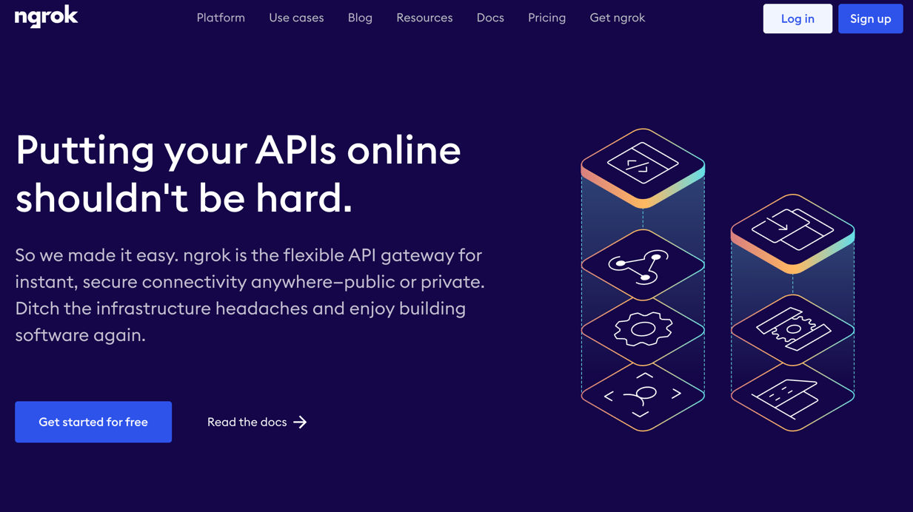
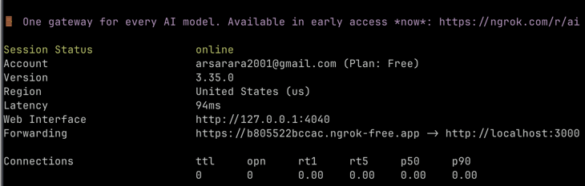
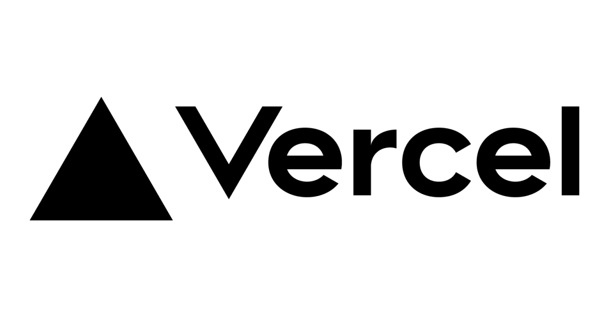

# Deployment

## Table of Contents

<!-- TOC -->

- [Deployment](#deployment)
  - [Table of Contents](#table-of-contents)
  - [Why do we need deployment?](#why-do-we-need-deployment)
  - [Table of Contents](#table-of-contents-1)
  - [Different deployment approaches](#different-deployment-approaches)
    - [Local hosting](#local-hosting)
    - [3rd-party deployment services](#3rd-party-deployment-services)
      - [Vercel](#vercel)
        - [Prerequisites](#prerequisites)
        - [Deploy using `vercel --yes` (fastest way)](#deploy-using-vercel---yes-fastest-way)
      - [Render](#render)
    - [Deployment Platforms](#deployment-platforms)
    - [Tunneling / Local Exposure (no Ngrok)](#tunneling--local-exposure-no-ngrok)
    - [Advanced (VPS + Your Own Nginx)](#advanced-vps--your-own-nginx)

<!-- /TOC -->

## Why do we need deployment?

During development, your project will typically run on a **local port** of your computer: **`localhost`** (e.g. `http://localhost:5173`).
But this setup works **only on your own machine**.

Other people:

- cannot see your website,
- cannot test it,
- cannot judge your project properly.

**Deployment makes your app, website, or other environment public** — accessible via a real URL that anyone can open.

If your project is not deployed, it might seem to the judges that your project is unfinished.

>[!WARN]
> This section covers only deployment of web-apps/web based projects. If your demo is not a web-app , consult other resources.

## Table of Contents

- [Deployment](#deployment)
  - [Table of Contents](#table-of-contents)
  - [Why do we need deployment?](#why-do-we-need-deployment)
  - [Table of Contents](#table-of-contents-1)
  - [Different deployment approaches](#different-deployment-approaches)
    - [Local hosting](#local-hosting)
    - [3rd-party deployment services](#3rd-party-deployment-services)
      - [Vercel](#vercel)
        - [Prerequisites](#prerequisites)
        - [Deploy using `vercel --yes` (fastest way)](#deploy-using-vercel---yes-fastest-way)
      - [Render](#render)
    - [Deployment Platforms](#deployment-platforms)
    - [Tunneling / Local Exposure (no Ngrok)](#tunneling--local-exposure-no-ngrok)
    - [Advanced (VPS + Your Own Nginx)](#advanced-vps--your-own-nginx)

## Different deployment approaches

We will cover three common approaches to deploying web apps, from easiest to hardest:

- **Local hosting** (temporary, fastest)
- **3rd-party deployment services** (still fast, and more long-term)

### Local hosting

This approach runs your app on your own laptop and exposes it to the internet.

> [!WARNING]  
> This is not production-grade, but very useful for quick demos!

We assume you have a website running on `http://localhost:PORT_NUMBER`. it doesn't matter whether this is through a DEV version of your
server, `DOCKER EXPOSE` or some other method.

Now you can use **Tunneling Tools** to create a *temporary public URL* that forwards traffic to your local machine.

Popular tunneling tools include:

- [NGrok](https://ngrok.com/)

- [Cloudflare tunnel](https://developers.cloudflare.com/cloudflare-one/networks/connectors/cloudflare-tunnel/)

To use NGrok , first you need to set up an account using the link above. Then install it using either brew:

```bash
brew install ngrok
```

or via instructions on their website: [Website](https://ngrok.com/download/windows)

Run the following command to add your authtoken to the default `ngrok.yml` configuration file.

```bash
ngrok config add-authtoken 1fmR26pVL0b5HM7AAYenEfavBE8_2X5Y6pvELCH7ezvu9R6r5
```

Deploy the app (where `PORT_NUMBER` is port you want to make public):

```bash
ngrok http PORT_NUMBER
```

After runnning this command you will see a terminal status window with current connections and a link to your globally-accessible NGrok webpage!


> [!CAUTION]
> If your laptop powers off or goes to sleep, **the site goes down**. If your internet disconnects, **the site goes down**. The URL to your deployed page **may change on restart**.

### 3rd-party deployment services

If we choose to deploy your web app to a third-party service, you might end up with a workflow as follows:

1. You **push your code** to the service's repository (usually via Git).
2. The service **automatically builds your application** using your specified build configuration.
3. The service **hosts your built application** on their infrastructure.
4. You receive a **stable public URL** that anyone can access.

#### Vercel

[Vercel](https://vercel.com/) is a platform for deploying **frontend web applications** and **static sites**.

It is one of the easiest ways to make a project publicly accessible.


Vercel can deploy:

- **Static frontend builds** (HTML, CSS, JavaScript),
- **Single-page applications** (React, Vue, Svelte, etc.),
- Frontend projects that produce a **build output directory**.

Vercel is **not meant** for heavy backend logic or long-running servers.

##### Prerequisites

- A Vercel account (you can log in with GitHub for ease)
- A project that can be **built locally** (i.e. it produces static files)

##### Deploy using `vercel --yes` (fastest way)

From your **frontend project directory** (where `package.json` is located), run:

```bash
npm install -g vercel
vercel login
vercel --yes
```

This set of commands automatically generates a new project and:

- Detects your frontend **project type and configuration**.
- Runs your project's **build command** to compile the application.
- **Deploys** the resulting static files to Vercel's hosting infrastructure.
- Generates a **public URL** where your application can be accessed.

You'll see output similar to

```bash
https://your-project-name.vercel.app
```

No configuration files required.

If you want to make a change to the project, just run the ***final command*** again:

```bash
vercel --yes
```

#### Render

[Render](https://render.com/) is a hosted platform that can run your *backend* as a **web service** (API) or host a **static site**. It supports native runtimes (like Python) and Docker-based deployments.

Render's **free tier** spins down after ~15 minutes with no inbound traffic, then will "wake up" on the next request (cold start delay).

Render will ask for the following:

- A **Build Command** (to install dependencies)
- A **Start Command** (to run the server)

For example, if we were attempting to deploy a **Python FastAPI** app on Render, we would first create a new **Web Service** on Render, and then provide the following values during service creation:

- **Language**: Python 3.
- **Build command**: `pip install -r requirements.txt`.
- **Start command**: `uvicorn main:app --host 0.0.0.0 --port $PORT`.

Your web service will then live on an `onrender.com` URL as soon as the deploy finishes.

---

There are many other third-party services and other methods for deployment out there, 
so don't feel restricted to just the ones we've mentioned in this HackPack! Just make sure that you heed the advice below...

### Deployment Platforms
- **[Netlify](https://www.netlify.com/)** — Free tier; static sites, Jamstack, and serverless functions.
- **[Heroku](https://www.heroku.com/)** — No permanent free tier anymore; supports full-stack apps with multiple languages
- **[Railway](https://railway.com/)** — Free credits; full-stack apps with managed databases.
- **[Fly.io](https://fly.io/)** — Free allowance; containerized apps with global edge deployment.
- **[AWS](https://aws.amazon.com/)** — Free tier + credits; flexible for web apps, APIs, containers, serverless, and more.
- **[Google Cloud](https://cloud.google.com/)** — Free tier + credits; supports scalable backend services, containers, and serverless.
- **[Microsoft Azure](https://azure.microsoft.com/en-us)** — Free credits; supports web apps, functions, and cloud services.

### Tunneling / Local Exposure (no Ngrok)
- **[Cloudflare Tunnel](https://developers.cloudflare.com/cloudflare-one/connections/connect-apps/)** — Free; expose local apps securely without public IP.
- **[LocalTunnel](https://theboroer.github.io/localtunnel-www/)** — Free; quick public URLs for local dev servers.

### Advanced (VPS + Your Own Nginx)
For a more advanced approach you can check renting your own server , where you can have more power over your
website configuration:

- **[DigitalOcean](https://www.digitalocean.com/)** — Paid; rent a VPS, full control with Nginx, Docker, SSL, custom networking.
- **[Hetzner Cloud](https://www.hetzner.com/cloud)** — Cheap VPS; high performance, great for backend-heavy apps.
- **[Vultr](https://www.vultr.com/)** — Paid; global VPS hosting with full OS and Nginx control.

> [!TIP]
> Use environment variables for secrets, redeploy after changes, and always assume free-tier services can restart or sleep at any time.

> [!WARNING]
> Some 3rd party services might charge you money depending on the plan you choose! Check autoscaling rules before advertising your project!
