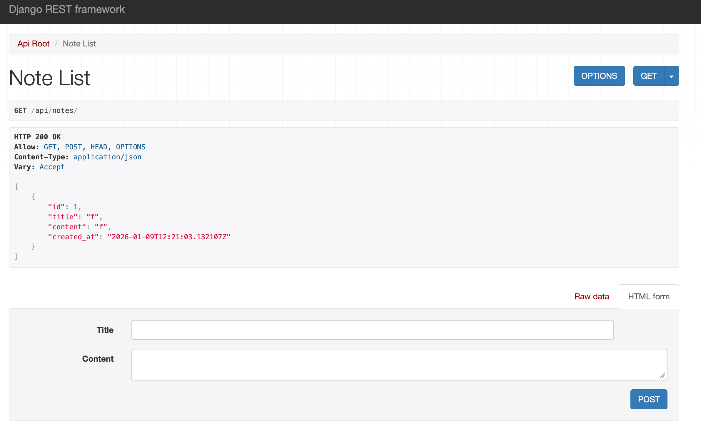

# Django Backend HackPack

This guide walks you through setting up a local **Django** backend for a simple hackathon project (in this case, it's a notes app). You'll learn how to install Python and Django on Windows/Mac/Linux, create a Django project and app, configure the built-in **SQLite** database, and use the **Django REST Framework (DRF)** to build a basic CRUD API.

- **What is Django?** Django is *"a high-level Python web framework that encourages rapid development and clean, pragmatic design"*. It lets you build web applications quickly, handling many common tasks (like database access and routing) for you.
- **What is Django REST Framework?** DRF is *"a powerful and flexible toolkit for building Web APIs"*. It makes it easy to expose your data (e.g. notes) as JSON over HTTP so that any frontend (mobile app, web UI, etc.) can use it.
- **Local deployment:** All steps below target running Django on your own machine. We'll use **SQLite** (the default database), which requires no extra installation. No cloud or complex servers are needed.

## Table of Contents

<!-- TOC -->

- [Django Backend HackPack](#django-backend-hackpack)
  - [Table of Contents](#table-of-contents)
  - [Prerequisites \& Setup](#prerequisites--setup)
  - [Creating a Django Project and App](#creating-a-django-project-and-app)
  - [Database Setup (SQLite)](#database-setup-sqlite)
  - [Building a Simple CRUD API (Notes)](#building-a-simple-crud-api-notes)
  - [Troubleshooting Common Issues](#troubleshooting-common-issues)
    - [1. `python` command not found](#1-python-command-not-found)
    - [2. `ModuleNotFoundError: No module named 'django'`](#2-modulenotfounderror-no-module-named-django)
    - [3. Permissions Errors (Mac/Linux)](#3-permissions-errors-maclinux)
    - [4. Database is locked](#4-database-is-locked)
  - [What's Next?](#whats-next)
    - [Phase 1: Pivot the Data Model](#phase-1-pivot-the-data-model)
      - [*Example*: Building a Marketplace](#example-building-a-marketplace)
    - [Phase 2: Add Relations (Connecting Data)](#phase-2-add-relations-connecting-data)
      - [*Example*: A `Category` can have many `Note`s](#example-a-category-can-have-many-notes)
    - [Phase 3: Handling Images](#phase-3-handling-images)
    - [Phase 4: Connecting the Frontend](#phase-4-connecting-the-frontend)

<!-- /TOC -->

## Prerequisites & Setup

1. **Install Python (3.8+).**

    - **Windows:** Download from [python.org](https://www.python.org/). Run the installer and check *"Add Python to PATH"*.
    - **macOS:** Python 3 is often pre-installed. If not, use *Homebrew* (`brew install python3`) or download from python.org.
    - **Linux (Ubuntu/Debian):** Use your package manager. For example:

    ```bash
        sudo apt update
        sudo apt install python3 python3-pip
    ```

2. **Verify installation** by running `python3 --version` and `pip3 --version` (should show Python 3.x).

    > ✅ **Checkpoint:** You should see something like `Python 3.11.4` and `pip 23.1.2`. The exact numbers may differ, but as long as Python is 3.8+, you're good!

3. **Create a virtual environment.** This keeps project dependencies isolated, so packages you install for this project won't conflict with other Python projects on your machine. From your project folder, run:

    ```bash
        python3 -m venv venv
        # Activate it:
        # Windows: 
        venv\Scripts\activate
        # macOS/Linux:
        source venv/bin/activate
    ```

    > ✅ **Checkpoint:** After activation, you should see `(venv)` at the beginning of your terminal prompt. This confirms you're working inside the virtual environment.

4. **Install Django and DRF.** With Python ready, install the required packages via `pip`:

    ```bash
    pip install django djangorestframework
    ```

    > ✅ **Checkpoint:** Run `pip list` to verify. You should see `Django` and `djangorestframework` in the list of installed packages.

## Creating a Django Project and App

In Django, a **project** is your entire web application, while an **app** is a self-contained module that handles one specific feature (like notes, user accounts, etc.). A project can contain multiple apps.

1. **Start a new project.** In your terminal, choose an empty folder for the project and run:

    ```bash
    django-admin startproject myproject
    # Change to the created directory 
    cd myproject  
    ```

2. **Start a new app.** Inside the project directory, run:

    ```bash
        python manage.py startapp notesapp
    ```

    > ✅ **Checkpoint:** You should now have a folder structure like this:
    >
    > ```text
    > myproject/
    > ├── manage.py
    > ├── myproject/
    > │   ├── __init__.py
    > │   ├── settings.py
    > │   ├── urls.py
    > │   └── wsgi.py
    > └── notesapp/
    >     ├── __init__.py
    >     ├── admin.py
    >     ├── models.py
    >     ├── views.py
    >     └── ...
    > ```

3. **Register the app.** Django needs to know about your app before it can use it. Open `myproject/settings.py` and add your new app (and DRF) to the `INSTALLED_APPS` list:

    ```python
        INSTALLED_APPS = [
            ...,
            'rest_framework',   # enable Django REST Framework
            'notesapp',         # our app (replace with your app name)
            ...
        ]
    ```

## Database Setup (SQLite)

Django uses SQLite by default for simple projects. To create the database and tables, run migrations. **Migrations** are Django's way of syncing your Python code with the database structure. They translate your models into actual database tables:

```bash
    python manage.py migrate
```

> ✅ **Checkpoint:** After running this, you should see a new `db.sqlite3` file in your project folder. This is your database!

## Building a Simple CRUD API (Notes)

**CRUD** stands for **C**reate, **R**ead, **U**pdate, **D**elete—the four basic operations you can do with data. A **REST API** lets other applications (like a mobile app or website) perform these operations over HTTP by sending requests to specific URLs (called *endpoints*).

Let's create a simple **Notes app** with `title` and `content` fields, exposed via a REST API.

1. **Define the model.** A *model* defines the structure of your data—think of it as a blueprint for a database table. Each field becomes a column. In `notesapp/models.py`, add a `Note` model:

    ```python
        from django.db import models

        class Note(models.Model):
            title = models.CharField(max_length=100)
            content = models.TextField()
            created_at = models.DateTimeField(auto_now_add=True)

            def __str__(self):
                return self.title
    ```

    This creates a `notesapp_note` table (after migrating) with `id`, `title`, `content`, and `created_at` columns.

2. **Create and apply migrations.** After saving the model, you need to tell Django to update the database. `makemigrations` creates a migration file describing the changes, and `migrate` applies them:

    ```bash
        python manage.py makemigrations
        python manage.py migrate
    ```

    > ✅ **Checkpoint:** You should see output mentioning the creation of the `Note` model.

3. **Register in Admin.** Django comes with a built-in admin panel where you can view and edit your data without writing any frontend code. Register the model in `notesapp/admin.py`:

    ```python
        from django.contrib import admin
        from .models import Note
        admin.site.register(Note)
    ```

    > ✅ **Checkpoint:** To test the admin panel, first create a superuser by running `python manage.py createsuperuser` and following the prompts. Then start the server (`python manage.py runserver`) and go to [http://127.0.0.1:8000/admin/](http://127.0.0.1:8000/admin/). Log in and you should see "Notes" listed!

4. **Create a serializer.** When your API sends data to a browser or app, it needs to be in a format they can understand (usually **JSON**). A *serializer* handles this conversion. It turns Python objects into JSON (and vice versa). In `notesapp` folder create a file `serializers.py` and add:

    ```python
    from rest_framework import serializers
    from .models import Note

    class NoteSerializer(serializers.ModelSerializer):
        class Meta:
            model = Note
            fields = ['id', 'title', 'content', 'created_at']
    ```

    Here, we create a class (**`class NoteSerializer`**) that inherits from DRF's `ModelSerializer`, meaning we can use all methods that are implemented in that class. This saves us time by automatically figuring out how to map database fields to JSON fields so we don't have to write that logic manually.

    - The inner `Meta` class is used to provide configuration to the main class.
    - `model = Note` tells the serializer exactly which Database Model it should look at.
    - `fields = [...]` explicitly defines which pieces of data should be included in the API. If you left 'created_at' out of this list, the API would hide that timestamp from the user.

5. **Create a ViewSet.** A *view* handles incoming requests and returns responses. A `ViewSet` bundles all the CRUD operations together, so you don't have to write separate functions for listing, creating, updating, and deleting. In `notesapp/views.py`, add:

    ```python
    from rest_framework import viewsets
    from .models import Note
    from .serializers import NoteSerializer

    class NoteViewSet(viewsets.ModelViewSet):
        queryset = Note.objects.all()
        serializer_class = NoteSerializer
    ```

    In this case, by inheriting from `ModelViewSet` our **`class NoteViewSet(viewsets.ModelViewSet)`** gets the logic for *Create*, *Read*, *Update*, and *Delete* for free. We don't have to write the functions ourselves!

    - `queryset = Note.objects.all()` defines the *data source*. It tells the view: "When someone asks for notes, look at the `Note` table and get `all()` of them."
    - `serializer_class = NoteSerializer` defines the *translator*. It tells the view: "When you get that data, use `NoteSerializer` to turn it into JSON before sending it to the user."

6. **Configure URLs.** URLs define the *endpoints* of your API—the addresses where clients send requests. A *router* automatically generates standard REST URLs for your ViewSet (like `/api/notes/` for listing and `/api/notes/1/` for a specific note). Create `notesapp/urls.py` and set up a router:

    ```python
        from django.urls import path, include
        from rest_framework.routers import DefaultRouter
        from .views import NoteViewSet

        router = DefaultRouter()
        router.register(r'notes', NoteViewSet)

        urlpatterns = [
            path('api/', include(router.urls)),
        ]
    ```

    Then include this in the project's `urls.py` (`myproject/urls.py`):

    ```python
        from django.contrib import admin
        from django.urls import path, include

        urlpatterns = [
            path('admin/', admin.site.urls),
            path('', include('notesapp.urls')),  # include our app's URLs
        ]
    ```

    Now the API will be accessible under `/api/notes/`.

7. **Run the server.** Start Django's development server:

    ```bash
        python manage.py runserver
    ```

8. Go to [http://127.0.0.1:8000/api/notes/](http://127.0.0.1:8000/api/notes/) in your browser. You should see a list (likely empty) and a form to create new notes.

    > ✅ **Checkpoint:** Try creating a note using the form at the bottom of the page! Fill in a title and content, then click POST. Your note should appear in the list above.

    It should look as follows:
    

## Troubleshooting Common Issues

If you run into errors, check out these common pitfalls:

### 1. `python` command not found

- **The Issue:** On some systems (especially Mac/Linux), the command `python` refers to an old version (Python 2) or doesn't exist, while `python3` is the correct command.
- **The Fix:** Refer to the [`manage.py`](https://github.com/icdocsoc/ichack-hackpacks/tree/main/django/manage.py) script. If `python manage.py ...` fails, try running `python3 manage.py ...` instead. On Windows, you might also try `py manage.py ...`.

### 2. `ModuleNotFoundError: No module named 'django'`

- **The Issue:** You likely installed Django, but your **Virtual Environment (venv)** is not active. Libraries are installed *inside* the environment, so if you aren't "inside" it, the computer can't find them.
- **The Fix:**
    1. Look at your terminal prompt. Does it start with `(venv)` or `(.venv)`?
    2. If not, activate it again:
        - **Windows:** `venv\Scripts\activate`
        - **Mac/Linux:** `source venv/bin/activate`
    3. Once activated, try the command again.

### 3. Permissions Errors (Mac/Linux)

- **The Issue:** You see "Permission denied" errors when running commands.
- **The Fix:** Avoid using `sudo` to install packages globally. Ensure you are using a virtual environment (see above), which creates a safe space where you have full permissions.

### 4. Database is locked

- **The Issue:** SQLite throws a "database is locked" error.
- **The Fix:** This usually happens if you have a database viewer open (like 'DB Browser for SQLite') while the server is trying to write to it. Close any programs that are viewing the `db.sqlite3` file and try again.

## What's Next?

You now have a working backend engine. While "Notes" are simple, this exact same architecture powers Instagram, Pinterest, and Jira.

Here is how to take this template and twist it into the project you want to build.

### Phase 1: Pivot the Data Model

The `Note` model is just a placeholder. Change `models.py` to fit your idea:

#### *Example*: Building a Marketplace

- Rename `Note` -> `Product`.
- Fields: `price` (DecimalField), `stock_count` (IntegerField), `description` (TextField).

*(Remember: Every time you change `models.py`, run `python manage.py makemigrations` and `python manage.py migrate`!)*

### Phase 2: Add Relations (Connecting Data)

Real apps have data that relates to other data. You can link models using **Foreign Keys**.

#### *Example*: A `Category` can have many `Note`s

1. Create a `Category` model.
2. Add `category = models.ForeignKey(Category, on_delete=models.CASCADE)` to your `Note` model.
3. Now your API will let you link notes to specific categories!

You can read more about **databases** in [their dedicated hackpack](/databases/README.md)!

### Phase 3: Handling Images

Hackathon projects love visuals. To let users upload images:

1. Install the image handler: `pip install Pillow`
2. Add a field to your model: `image = models.ImageField(upload_to='uploads/')`
3. Add `image` to your `serializers.py` fields list.
4. Now your API accepts file uploads!

### Phase 4: Connecting the Frontend

Your backend is running on port 8000. Now you need a frontend (React, Vue, Mobile App) to talk to it.

- **The Endpoint:** `http://127.0.0.1:8000/api/notes/`
- **The Fetch:** Use standard HTTP requests.

    ```javascript
    // Example JavaScript fetch
    fetch('[http://127.0.0.1:8000/api/notes/](http://127.0.0.1:8000/api/notes/)')
      .then(response => response.json())
      .then(data => console.log(data));
    ```

This topic is covered extensively in [the API design HackPack](/api-design/README.md).

> [!tip]
> If your frontend is blocked by "CORS" errors, install `django-cors-headers`. It's the most common "gotcha" when connecting frontends to backends!
