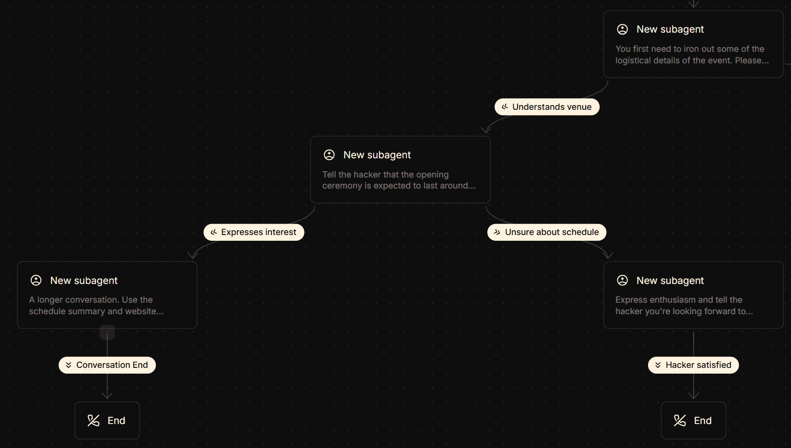

# 'Best Use of ElevenLabs' Challenge

***DISCLAIMER**: Many thanks to the ElevenLabs team for providing their [hacker guide](https://docs.google.com/document/d/1mCh5MtOzBw0aJpurQVUmIVFfPMAHW3MjNemE-LNiMto/edit?usp=sharing) to us. Much of the material in this HackPack is adapted from that document.*

## Table of Contents

- ['Best Use of ElevenLabs' Challenge](#best-use-of-elevenlabs-challenge)
  - [Table of Contents](#table-of-contents)
  - [About the Challenge](#about-the-challenge)
  - [Free Credits](#free-credits)
    - [Support](#support)
  - [Using ElevenLabs](#using-elevenlabs)
    - [An IC Hack Greeter](#an-ic-hack-greeter)
    - [Setting Up the Agent with the Python SDK](#setting-up-the-agent-with-the-python-sdk)
      - [Prerequisites](#prerequisites)
      - [Step 1: Install Dependencies](#step-1-install-dependencies)
      - [Step 2: Configure Your Environment](#step-2-configure-your-environment)
      - [Step 3: Building the Code Step-by-Step](#step-3-building-the-code-step-by-step)
        - [3.1 - Import Required Modules](#31---import-required-modules)
        - [3.2 - Initialize the ElevenLabs Client](#32---initialize-the-elevenlabs-client)
        - [3.3 - Configure Dynamic Variables (Optional)](#33---configure-dynamic-variables-optional)
        - [3.4 - Create the Conversation](#34---create-the-conversation)
        - [3.5 - Start the Conversation](#35---start-the-conversation)
        - [What Happens During the Conversation?](#what-happens-during-the-conversation)
      - [Step 4: Run Your Agent](#step-4-run-your-agent)
    - [Troubleshooting](#troubleshooting)
    - [Going Further](#going-further)
  - [Quick Links](#quick-links)
  - [Further Inspiration: Best Projects of 2025](#further-inspiration-best-projects-of-2025)

## About the Challenge

ElevenLabs is sponsoring IC Hack and running a **"Best Use of ElevenLabs"** challenge. They're offering their powerful AI voice platform for you to build innovative projects that leverage voice technology, conversational AI agents, or audio generation.

**What is ElevenLabs?**

> ElevenLabs is the leading AI voice platform that enables you to create lifelike speech in any voice and style across 32 languages. Their technology powers everything from content creation and accessibility tools to conversational AI agents and entertainment.

Key capabilities include:

- **Text-to-Speech**: Generate natural-sounding speech in 32 languages
- **AI Agents**: Deploy conversational agents with ultra-low latency
- **Voice Cloning**: Create and customize unique voices
- **Speech-to-Text**: Transcribe audio with high accuracy
- **Audio Generation**: Create music and sound effects from text
- **Dubbing**: Translate audio while preserving emotion and timing

## Free Credits

ElevenLabs is providing all IC Hack participants with **3 free months of their Creator Plan**.

**How to claim:**

1. [Join the ElevenLabs Discord](https://discord.com/invite/VnBvbbcdEC).
2. Access the `#🎟️│coupon-codes` channel.
3. Click "Start Redemption" and select IC Hack.
4. Fill out the form **using the email you registered with**.
5. The bot will send you your unique coupon code.

**[Tutorial video](https://www.youtube.com/watch?v=S143_JtCtV8)**.

### Support

ElevenLabs staff will be present in the `#elevenlabs` channel of our IC Hack Discord. Otherwise, feel free to reach out to them in the `#hackathon-support` channel of the previously-mentioned server.

## Using ElevenLabs

The two major platforms you can access with your new ElevenLabs subscription are their [Agents](https://elevenlabs.io/app/agents) and [Creative](https://elevenlabs.io/app/home) platforms.

The Creative platform acts primarily as a **text-to-speech** service, but also offers **voice changer**, **sound effects**, **voice isolator**, and (brand-new) **image & video** functionality.

Most of these capabilities can be accessed through the ElevenLabs API, which we'll go through in more detail later.

Furthermore, the Agents platform allows you to configure multimodal (telephone, web, and mobile) agents across the online dashboard, [the ElevenLabs API](https://elevenlabs.io/docs/api-reference/introduction), or the [Agents CLI](https://elevenlabs.io/docs/agents-platform/operate/cli).

We'll now focus on how exactly you could build an agent.

### An IC Hack Greeter

For this example, I've built an agent that **greets IC Hack attendees** before the event, clarifies an important logistical detail (the change in opening ceremony venue), and optionally goes through the schedule with hackers who are comfortable with that.

You can [access the agent directly](https://elevenlabs.io/app/talk-to?agent_id=agent_0401kfw5j56verham6s1msm7eawe&branch_id=agtbrch_4601kfw5j6vzevn9vj9zkj71pkz6&vars=eyJuYW1lIjogIkFkYW0gS2Fzc2FtIiwgInN0dWRlbnRfeWVhciI6ICJUaGlyZCBZZWFyIFVuZGVyZ3JhZHVhdGUiLCAidW5pdmVyc2l0eV9uYW1lIjogIkltcGVyaWFsIENvbGxlZ2UgTG9uZG9uIn0=) and [play around with it yourself by modifying the dynamic variables encoded in the URL](https://elevenlabs.io/docs/agents-platform/customization/personalization/dynamic-variables#method-2-individual-query-parameters).

The agent was created through the online Agents platform, and allows you to pass in three 'variables': the hacker *name*, their *year of university*, and *which university* they attend, so that each conversation is personal.

> [!note]
> In my example, the variables are set by default to my own personal values, but these are easily modifiable when you build your own agent.

The primary tool I used when constructing this agent was the **Workflow** tab, which allows you to branch off to different conversational paths depending on the LLM of choice's perception of the user's response. I've inserted a snapshot below of my agent's workflow to show off the cases where the hacker is happy with the change of venue, and where they either express interest in, or are unsure about listening to the agent go through the schedule.



Furthermore, I also utilised the **Knowledge Base** tab to give the agent some extra information to use in its conversation. Specifically, I configured it with the IC Hack website, and a Markdown-formatted schedule to give it more context on the weekend as a whole.

### Setting Up the Agent with the Python SDK

Now that you understand how the agent is configured, let's walk through how to interact with it using the ElevenLabs Python SDK. This example demonstrates how to build a conversational interface that your users can interact with via voice.

#### Prerequisites

- Python 3.8 or higher
- `pip` (Python package manager)
- A microphone and speakers for voice interaction

#### Step 1: Install Dependencies

First, create a virtual environment (recommended) and install the required packages:

```bash
# Create and activate a virtual environment (optional but recommended)
python -m venv venv
source venv/bin/activate  # On Windows: venv\Scripts\activate

# Install the ElevenLabs SDK with audio support
pip install "elevenlabs[pyaudio]" python-dotenv
```

> [!tip]
> If you encounter build errors with `pyaudio` on Windows, try: `pip install --only-binary=:all: elevenlabs` to use pre-built wheels only.

#### Step 2: Configure Your Environment

Create a `.env` file in your project directory to store your API credentials:

```env
ELEVENLABS_API_KEY=your_api_key_here
ELEVENLABS_AGENT_ID=your_agent_id_here
```

You can find your API key in the [ElevenLabs dashboard](https://elevenlabs.io/app/settings/api-keys) and your Agent ID in your agent's settings page. The ID for my agent is **`agent_0401kfw5j56verham6s1msm7eawe`**, if you want to experiment with that for now.

#### Step 3: Building the Code Step-by-Step

The complete working example is available in [`ic-hack-greeter/agent.py`](ic-hack-greeter/agent.py), but let's walk through building it from scratch so you understand what each piece does.

##### 3.1 - Import Required Modules

Start by importing the necessary modules:

```python
import os
from dotenv import load_dotenv
from elevenlabs.client import ElevenLabs
from elevenlabs.conversational_ai.default_audio_interface import DefaultAudioInterface
from elevenlabs.conversational_ai.conversation import Conversation, ConversationInitiationData
```

- `load_dotenv`: Loads your API credentials from the `.env` file
- `ElevenLabs`: The main client for authenticating with the API
- `DefaultAudioInterface`: Handles microphone input and speaker output
- `Conversation` and `ConversationInitiationData`: Core classes for managing voice conversations

##### 3.2 - Initialize the ElevenLabs Client

Next, load your environment variables and create an authenticated client:

```python
load_dotenv()

client = ElevenLabs(api_key=os.getenv("ELEVENLABS_API_KEY"))
agent_id = os.getenv("ELEVENLABS_AGENT_ID")
```

The `client` handles all API communication and authentication. The `agent_id` identifies which agent configuration to use from the ElevenLabs platform.

##### 3.3 - Configure Dynamic Variables (Optional)

If your agent uses dynamic variables for personalization, set them up:

```python
dynamic_vars = {
    "name": "John Smith",
    "student_year": "Third Year Undergraduate",
    "university_name": "Imperial College London"
}

config = ConversationInitiationData(
    dynamic_variables=dynamic_vars
)
```

In your agent's configuration on the ElevenLabs platform, you can reference these variables using `{{variable_name}}` syntax. For example, your agent's prompt might say: *"Hello {{name}}, welcome to {{university_name}}!"*

> [!tip]
> Make these dynamic by collecting user input: `dynamic_vars = {"name": input("What's your name? ")}`

##### 3.4 - Create the Conversation

Now create the conversation instance that ties everything together:

```python
conversation = Conversation(
    client=client,
    agent_id=agent_id,
    requires_auth=True,
    audio_interface=DefaultAudioInterface(),
    config=config,
    callback_agent_response=lambda response: print(f"Agent: {response}"),
    callback_user_transcript=lambda transcript: print(f"User: {transcript}"),
)
```

Let's break down these parameters:

- `client` and `agent_id`: Connect to your specific agent
- `requires_auth=True`: Whether the agent requires API authentication (set to `False` for public agents)
- `audio_interface`: Uses your system's default microphone and speakers
- `config`: Passes your dynamic variables to the agent
- `callback_agent_response`: Called whenever the agent speaks, letting you log or display responses
- `callback_user_transcript`: Called when your speech is transcribed, letting you see what the agent heard

##### 3.5 - Start the Conversation

Finally, start the conversation and wait for it to complete:

```python
print("Starting conversation with your agent...\n")

conversation.start_session()
conversation_id = conversation.wait_for_session_end()

print(f"\nConversation ended. ID: {conversation_id}")
```

- `start_session()`: Opens the audio connection and begins listening to your microphone
- `wait_for_session_end()`: Blocks until the conversation ends naturally (when the agent decides to end it)
- The conversation ID is returned for logging or reviewing conversation history

##### What Happens During the Conversation?

1. Your microphone captures your speech
2. The audio is sent to ElevenLabs for transcription
3. The transcription is sent to your agent's LLM (configured on the platform)
4. The LLM generates a response based on your agent's prompts and knowledge base
5. The response is converted to speech and played through your speakers
6. The callbacks print both the transcription and response to your console

All of this happens in real-time with ultra-low latency!

#### Step 4: Run Your Agent

```bash
python agent.py
```

The agent will start listening to your microphone and respond through your speakers. The conversation will continue until the agent decides to end it based on its configuration.

### Troubleshooting

- **Make variables dynamic**: Replace the hardcoded values in `dynamic_vars` with user input:

  ```python
  dynamic_vars = {
      "name": input("What's your name? "),
      "student_year": input("What year are you in? "),
      "university_name": input("What university? ")
  }
  ```

- **Use environment variables for personalization**: You can also load dynamic variables from your `.env` file for different configurations.

- **Adjust authentication**: If your agent is public, set `requires_auth=False` in the `Conversation` constructor.

- **PyAudio installation issues**: On Windows, you may need to install PyAudio from pre-built wheels. Try `pip install --only-binary=:all: elevenlabs` instead.
- **Microphone not detected**: Ensure your system has a default audio input device configured.
- **API authentication errors**: Verify your API key is correct in the `.env` file.

### Going Further

There's so much more you can do than just a simple agent conversation with the ElevenLabs API! Check out the [quick links](#quick-links) below, including the **documentation**, for more information.

Good luck, and happy hacking!

## Quick Links

- [**Sign-up**](https://elevenlabs.io/app/sign-up),
- [**API docs**](https://elevenlabs.io/docs/api-reference/introduction),
- [**Agent docs**](https://elevenlabs.io/docs/conversational-ai/docs/introduction),
- [**Agents Quickstart**](https://elevenlabs.io/docs/agents-platform/quickstart),
- [**Developer Quickstart**](https://elevenlabs.io/docs/developers/quickstart).

## Further Inspiration: Best Projects of 2025

| Project | Description |
| :---- | :---- |
| [Reconnect Generations](https://lnkd.in/drKuwtUe) | Preserves family members' voices, stories, and legacies through AI-guided interviews |
| [Aphasio](https://lnkd.in/dt_guwea) | Speech practice app for people with aphasia |
| [Kisan](https://lnkd.in/dQqCxN7B) | Voice-first, multilingual AI assistant for small-scale farmers in India |
| [Meat-tracker](https://lnkd.in/dPxi257s) | WiFi x-ray advanced motion detection system |
| [Leetcourt](https://lnkd.in/d5HihvdR) | Interactive courtroom simulation for legal practice |
| [HireMeMaybe](https://lnkd.in/ddAcTfas) | Let the universe guide your hiring decisions with AI |
| [Orva](https://lnkd.in/dNkM4j5K) | Voice-driven PerioCharting agent for dental practices |
| [AI Tutoring Whiteboard](https://lnkd.in/eMfXDh4p) | Do your math homework with AI voice guidance |
| [TwelveLab](https://lnkd.in/e6T-8u8Y) | Personalize YouTube content with AI voices |
| [Pronunciation Coach](https://lnkd.in/ei6cX2KB) | Practice speaking naturally with instant AI feedback |
| [TwoCents](https://lnkd.in/eaSARsZB) | Share two perspectives and let AI voices discuss them |
