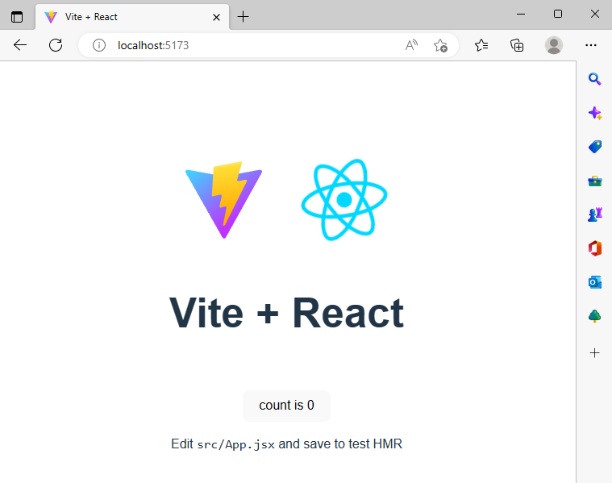
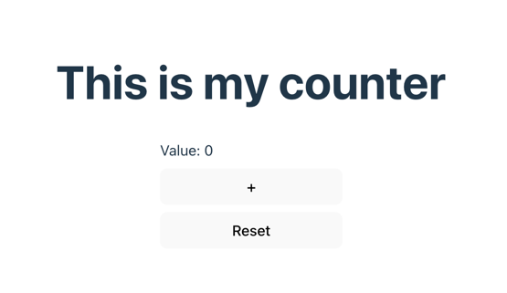

# React

## Table of Contents

<!-- TOC -->

- [React](#react)
  - [Table of Contents](#table-of-contents)
  - [What is React?](#what-is-react)
    - [Why it’s great for hackathons](#why-its-great-for-hackathons)
  - [How to start](#how-to-start)
    - [Required JS/TS](#required-jsts)
    - [Repo structure (recommended)](#repo-structure-recommended)
    - [Create a React app with Vite (recommended)](#create-a-react-app-with-vite-recommended)
    - [Files created by Vite](#files-created-by-vite)
      - [*'No restart required'*](#no-restart-required)
  - [What are React components?](#what-are-react-components)
  - [What is state?](#what-is-state)
  - [What are hooks?](#what-are-hooks)
    - [`useState` hook and state management](#usestate-hook-and-state-management)
    - [`useEffect` and its side effects](#useeffect-and-its-side-effects)
    - [Rerender mechanics and the `useEffect` trap](#rerender-mechanics-and-the-useeffect-trap)
  - [*Example*: Page using a `Counter maxValue={...}`](#example-page-using-a-counter-maxvalue)
  - [Some short and useful hooks](#some-short-and-useful-hooks)
  - [Styling in React (quick overview)](#styling-in-react-quick-overview)
    - [Plain CSS (`.css` files)](#plain-css-css-files)
      - [How it works](#how-it-works)
    - [CSS Modules](#css-modules)
    - [Inline styles](#inline-styles)
    - [Tailwind CSS](#tailwind-css)
  - [Deployment](#deployment)
    - [Build commands](#build-commands)
    - [Production builds](#production-builds)
    - [**Express** *example*: Serve the built frontend from a Node backend](#express-example-serve-the-built-frontend-from-a-node-backend)
    - [*FastAPI* default path frontend serving](#fastapi-default-path-frontend-serving)
    - [Other deployment options](#other-deployment-options)
  - [Key takeaways](#key-takeaways)

<!-- /TOC -->

## What is React?

**React** is a JavaScript library for building user interfaces by composing **reusable components**.
You write UI as a function of state, and React updates the '**DOM**' ([Document Object Model](https://legacy.reactjs.org/docs/faq-internals.html)) efficiently when state changes.

States are explained in more detail within the "[What is state?](#what-is-state)" section.

You can read more about efficient DOM update in [UI Tree](https://react.dev/learn/preserving-and-resetting-state).

### Why it’s great for hackathons

- **Fast iteration**: instant updates while you code (Hot Module Reloading).
- **Component reuse**: build small pieces once, reuse everywhere.
- **Huge ecosystem**: UI libs, routers, state tools, deploy platforms.
- **Team-friendly**: clear structure; easy to split work (“you take this component/page”).

[Official docs](https://react.dev/).

## How to start

### Required JS/TS

You can use plain **JavaScript**, but **ts (TS)** is strongly recommended.
TS can be thought of as **JS + types**, which catches dumb bugs early and makes teamwork easier.

[ts docs](https://www.tslang.org/).

### Repo structure (recommended)

If your IC Hack repo has both a backend and frontend component, keep them separated:

```txt
my-project/
backend/
frontend/
```

This prevents dependency/configuration chaos and makes deployment easier.

We cover backend/frontend integration in more depth in the [API design HackPack](/api-design/README.md).

### Create a React app with Vite (recommended)

[**Vite**](https://vitejs.dev/) is a modern development server + build tool. It creates and bundles required modules and files for a basic React project.

```bash
mkdir frontend
cd frontend

npm create vite@latest . -- --template react-ts
npm install
npm run dev
```

Open the URL printed in the terminal (usually in the format <http://localhost:PORT_NUMBER>, for your Vite server's dedicated port).

You should see something like this:



### Files created by Vite

**`package.json`** is an important file that you'll come across. It contains your project metadata, scripts, and dependencies.

In this file also lies some **example scripts**: `dev`, `build` & `preview`. These define what happens when you run `npm run dev`, `npm run build` etc.

The files  below **lock the exact dependency versions** on your project so everyone gets the same installs.

  ```txt
  package-lock.json (npm) / pnpm-lock.yaml / yarn.lock
  ```

**`tsconfig.json`** (with the optional addition of `tsconfig.app.json` & `tsconfig.node.json`) specifies **TypeScript compiler options** (strictness, module settings, path aliases, etc.)

**`vite.config.ts`** gives your **Vite configuration** (plugins, aliases, proxies, build options).

**`index.html`** is the single **HTML entry point** (Vite injects your JS into it) for your web app.

**`src/main.tsx`** is the **real entry file**. It mounts React into the DOM.

**`src/App.tsx`** is the starter React component that you’ll edit first.

#### *'No restart required'*

When you edit `src/App.tsx` (or any React component), Vite does '**HMR**' (Hot Module Replacement), updating the page instantly without restarting the server.

This is why React dev feels “live”.

## What are React components?

A **component** is a reusable UI unit. In modern React, components are usually functions (not classes).

They:

- Take **props** (inputs),
- Return **JSX** (HTML-like syntax),
- Can have **state** via hooks (e.g `useState`).

A common repository structure for a React app using components might look like the following:

```bash
src/
  components/   # reusable UI building blocks (buttons, cards, Counter, etc.)
  pages/        # full screens/routes (HomePage, DashboardPage, etc.)
  App.tsx
```

In the below example, `name` is a 'prop', and the `return` value is JSX code.

```ts
export function Greeting(name : string) {
  return <h1>Hello, {name}!</h1>;
}
```

Then we can use this component in another component or a page:

```jsx
<Greeting name="ICHack Hacker" />
```

## What is state?

**State** is data that belongs to a component and **can change over time**.

State represents the **current condition of the UI**:

- counter value
- form input
- loading flag
- fetched data

When **state changes**, React **re-renders the component**.
During this re-render, React compares the new output with the previous one and updates the DOM only if the rendered UI has changed.
If the state change does not affect what is rendered, no visible DOM update occurs.

You never update the DOM directly in React.
You update state, and React updates the UI for you.

In vanilla JavaScript, you would manually manipulate the DOM:

```javascript
document.getElementById("count").innerText = count;
```

Meanwhile, in React, you don’t use APIs like `getElementById`, querySelector, or manual HTML updates.

Instead, you declare what the UI should look like for a given state in JSX code (the one that components return).

```jsx
<p>{count}</p>
```

When `count` changes: React re-renders the component, figures out what actually changed and then updates DOM.

## What are hooks?

**Hooks** are functions provided by React that let function components:

- store state,
- run side effects,
- access lifecycle-like behavior.

Hooks:

- start with `use`,
- can only be called **at the top level** of a component,
- cannot be called conditionally or inside loops.

Hooks exist because **function components are re-executed on every render**.

If you used a normal variable or function-scoped value, it would be recreated on every re-render and lose its previous value:

```tsx
function Counter() {
  let count = 0; // ❌ resets on every render
  count++;
}
```

### `useState` hook and state management

`useState` is the most basic hook.  
It lets a component *store state and update it*.

- count → current state value
- setCount → function to update state

```tsx
export function Greeting(name : string) {
  const [count, setCount] = useState(0);
  
  return 
  <div>
    <h1>Hello, {name}!</h1>
    <button onClick={() => setCount(count + 1)}>
      I pressed this button {count} number times!
    </button>
  </div>;
}
```

### `useEffect` and its side effects

`useEffect` is used for side effects — code that interacts with the outside world.

Common use cases:

- **Fetching data**

```ts
  useEffect(() => {
    async function fetchUsers() {
      const res = await fetch("https://jsonplaceholder.typicode.com/users");
      const data = await res.json();
      setUsers(data);
      setLoading(false);
    }

    fetchUsers();
  }, []);

  return (
          <ul>{users.map((u) => (
              <li key={u.id}>{u.name}</li>
            ))}
          </ul>
  );
```

- **Timers** (to start a timer the first time person comes to a page)

- **Subscriptions**

- **Logging** (e.g logging every time the component rerenders)

- **Syncing with browser APIs** (e.g `window.addEventListener("resize", onResize);`)

A basic example that runs once per load of the page:

```ts
useEffect(() => {
  console.log("Component rendered");
}, []);
```

The effect runs after the component renders. The **dependency array** controls when the effect runs based on state or prop changes. In the basic case, an empty array `[]` means the effect runs only once after the initial render.

The dependency array follows these patterns:

```ts
useEffect(() => { ... }, [])        // run once (on mount)
useEffect(() => { ... }, [count])   // run when `count` changes
useEffect(() => { ... })            // run after every render
```

It's also important to consider **clean-up** in `useEffect` to avoid unnecessary behaviour.

```ts
useEffect(() => {
  const id = setInterval(() => {}, 1000);
  return () => clearInterval(id);
}, []);
```

In this example, we remove the `Interval` object after the component is *Unmounted* (disappears from the DOM).

### Rerender mechanics and the `useEffect` trap

The '**rerender rule**' describes how a component rerenders when its state, props, or context changes.

The common `useEffect` trap, which some people can fall into and which causes an infinite loop, can be seen below.

```ts
useEffect(() => {
  setValue(value + 1);
}, [value]);
```

The `setValue()` call updates `value`, which triggers the `useEffect()` again, forever.

Some *better* patterns can be seen below.

- Only run the effect once on **mount**.

```ts
useEffect(() => {
  // run once
}, []);
```

- Fetch data safely (and avoid setting state if unmounted).

```ts
useEffect(() => {
  const controller = new AbortController();

  (async () => {
    const res = await fetch("/api/data", { signal: controller.signal });
    const json = await res.json();
    // setState(json)
  })();

  return () => controller.abort();
}, []);
```

If this code doesn't make too much sense to you, read the [docs on Effects](https://react.dev/learn/synchronizing-with-effects) properly (it’s where most beginner bugs come from):

## *Example*: Page using a `Counter maxValue={...}`

To develop our understanding of components further, let's take a look at how we could **develop a page** in React using a **`Counter` component**.

It will have a simple counter with two buttons (reset and increment) as well as a `maxValue` which disables the increment button when reached.

All code snippets below are available in the [example project](/frontend-development/react/vite-project/).

[`src/components/Counter.tsx`](/frontend-development/react/vite-project/src/components/Counter.tsx)

```ts
import { useState } from "react";

type CounterProps = {
  maxValue: number;
};

export function Counter({ maxValue }: CounterProps) {
  const [value, setValue] = useState(0);

  const inc = () => setValue((v) => Math.min(v + 1, maxValue));
  const reset = () => setValue(0);

  return (
    <div style={{ display: "grid", gap: 8, maxWidth: 240 }}>
      <div>Value: {value}</div>
      <button onClick={inc} disabled={value >= maxValue}>
        +
      </button>
      <button onClick={reset}>Reset</button>
    </div>
  );
}
```

Above is a functional React component called `Counter`. It is exported so it can be reused in other files, for example inside a `HomePage` component.

The component receives its input via `props`. Here, `{ maxValue }` uses **object destructuring** to extract the `maxValue` field directly from the props object.

React always passes a **single props object** to a component, so a function signature like `Counter(name, value)` would not work. Instead, props must be accessed either via `props.name` or by destructuring, as in `Counter({ name, value })`.

Since this component is written in TypeScript, a dedicated type `CounterProps` is defined to describe the shape of the props object. This allows the compiler to catch incorrect usage at compile time and improves code clarity.

In this case, `CounterProps` specifies that `maxValue` must be a number.

The `useState` hook is used to create component state. Here, `value` stores the current counter value and
`setValue` updates it. Hooks are placed at the top level of the component to ensure they are called in a
consistent order on every render.

Two functions are then defined: `inc()`, which increments the counter while enforcing the `maxValue` limit, and `reset()`, which resets the counter to zero. These functions are later passed as **event handlers** to buttons.

The component returns JSX with minimal inline styling. In JSX, `{value}` evaluates a JavaScript expression and inserts its result into the React element tree during rendering.

Finally, the `disabled` HTML attribute is used on the increment button to prevent further clicks when the counter reaches `maxValue`. `OnClick=` attribute specifies what function is executed on click of the button.

> [!NOTE]
> In JSX, writing `onClick={fn}` passes the function, while `onClick={fn()}` executes it immediately during rendering.

[`src/pages/HomePage.tsx`](/frontend-development/react/vite-project/src/pages/HomePage.tsx)

```ts
import { Counter } from "../components/Counter";

export function HomePage() {
  return (
    <div style={{ padding: 24 }}>
      <h1>This is my counter</h1>
      <Counter maxValue={10} />
    </div>
  );
}
```

Above is a simple example of a `HomePage` functional component.

It renders a heading, and the `Counter` component created in the previous snippet. The `Counter` is used as a JSX element and receives `maxValue={10}` as a prop.

Because props flow from parent to child, the value `10` is passed from `HomePage` into `Counter`,
where it is used to limit the maximum counter value.

> [!NOTE]
> If `maxValue` were changed inside the `HomePage` component (for example, via state or props), React would re-render `HomePage` and consequently re-render `Counter` with the updated value.

[`src/App.tsx`](/frontend-development/react/vite-project/src/App.tsx)

```ts
import { HomePage } from "./pages/HomePage";

export default function App() {
  return <HomePage />;
}
```

The `App` component is typically the **main entry point** of a React application. It defines the top-level structure of the UI and determines which components are rendered.

In this example, `App` renders the `HomePage` component directly. In small applications, this can be sufficient, but as an application grows, `App` usually becomes the place where global configuration and layout are defined.

A common responsibility of `App` is setting up routing. By integrating a router (for example, [React Router](https://reactrouter.com/)), the application can render different pages based on the current URL, enabling navigation between multiple views without reloading the page.

Instead of rendering `HomePage` directly, `App` could render a router configuration that maps URL paths to page components.

> [!NOTE]
> In larger applications, `App` often hosts global providers such as routers, theme providers, or state management providers, making it the root of the component tree.

After running the app, you should see something like this.



## Some short and useful hooks

There is a lots of other functionality in React hooks besides remembering the state.

- `useState` — local component state.
- `useEffect` — run side effects (fetching, subscriptions, timers)
- `useMemo` — memoize expensive computed values
- `useCallback` — memoize function references (useful when passing callbacks deep).
- `useRef` — mutable value that doesn’t trigger rerenders; also DOM refs.
- `useContext` — share data across many components without prop-drilling

Refer to [the React docs](https://react.dev/reference/react/hooks) for a full list.

For bigger apps, you might find these further resources useful too:

- [Router (pages + URLs)](https://reactrouter.com/).

- [Context (global state)](https://react.dev/learn/passing-data-deeply-with-context).

## Styling in React (quick overview)

**Styling** is a core part of web development.

HTML only defines the structure (the “skeleton”) of a website. By default, elements like text, buttons, and links have generic styles for colors, spacing, and layout.

To control how elements look and where they are positioned, you must use styling. Browsers use only CSS to understand how to render your elements,
however, there are many existing methods to provide browser with CSS instructions.

There is **no single “correct” way** to style React apps. For IC Hack, pick the fastest option your team already knows, or go with whatever looks most understandable out of the options we give.

### Plain CSS (`.css` files)

The simplest and most explicit approach.

#### How it works

- Write ['normal CSS'](https://www.w3schools.com/csSref/index.php)
- Import it directly into a React component or entry file

```css
/* src/styles/main.css */
.container {
  display: flex;
  justify-content: center;
  align-items: center;
}
```

```ts
import "./styles/main.css";

export function HomePage() {
  return <div className="container">Hello</div>;
}
```

### CSS Modules

Same as CSS, but *scoped* by default. **This approach is recommended** if your team ends up using plain CSS, since styles will be applied only to the components that import them, avoiding mess.

File name **must be** in the format `*.module.css.`

```css
/* Counter.module.css */
.wrapper {
  padding: 16px;
}
```

```ts
import styles from "./Counter.module.css";

export function Counter() {
  return <div className={styles.wrapper}>Counter</div>;
}
```

This approach also gives us the benefit of avoiding **class name collisions**.

### Inline styles

You would have already come across this approach in the earlier examples.

```ts
<div style={{ display: "flex", alignItems: "center" }} />
```

Here, we remove the need for **extra files** to define our CSS styles.

### Tailwind CSS

A utility-first CSS framework. You style directly in the `className` prop of a component.

```ts
<div className="flex flex-col items-center justify-center min-h-screen p-6">
<h1 className="text-2xl font-bold">This is my counter</h1>
</div>
```

This enables **fast development**, since:

- you don’t switch context between JSX and separate CSS files,
- no need to invent or maintain class names,
- styles are applied instantly without writing new CSS,
- layout and spacing are predictable and consistent,
- no need for extra css classes.

The downside is learning Tailwind syntax, which is a bit different from plain CSS.

Refer to [the official Tailwind docs](https://tailwindcss.com/docs/installation/using-vite) for more info.

## Deployment

We will cover how to create a build file from your React project which can be later pulled from a backend API.

### Build commands

You will probably find the below commands useful to try out, build and run your application through the Vite server.

- **`npm run dev`** starts a Vite **development server**.
- **`npm run build`** generates a **production build**, which will output static files in the process.
- **`npm run preview`** allows you to **preview the production build** locally.

### Production builds

Vite builds your React app into **vanilla JS/CSS/HTML assets** in `dist/` when you are ready for an actual production build.

Your React app will still be running in the browser, but now it’s bundled and optimised for production.

### **Express** *example*: Serve the built frontend from a Node backend

If your backend is written in [Express](https://expressjs.com/), you can serve the `dist/` folder at `/`:

```js
import express from "express";
import path from "path";

const app = express();
const distPath = path.join(process.cwd(), "frontend", "dist");

app.use(express.static(distPath));

// SPA fallback: send index.html for unknown routes
app.get("*", (req, res) => {
  res.sendFile(path.join(distPath, "index.html"));
});

app.listen(3000, () => console.log("Server running on http://localhost:3000"));
```

### *FastAPI* default path frontend serving

```py
from fastapi import FastAPI
from fastapi.staticfiles import StaticFiles
from fastapi.responses import FileResponse
from pathlib import Path

app = FastAPI()

dist_path = Path(__file__).parent / "frontend" / "dist"

# Serve static assets (JS, CSS, images)
app.mount("/assets", StaticFiles(directory=dist_path / "assets"), name="assets")

@app.get("/{full_path:path}")
def serve_spa(full_path: str):
return FileResponse(dist_path / "index.html")
```

### Other deployment options

- Deploy the frontend for your application separately (simplest) and call your backend via **HTTP**.
  - *Example backends*: Vercel, Netlify, Cloudflare Pages, GitHub Pages.
- Or **host your static assets** from `dist/` on any static server (NGINX, S3, etc.).

## Key takeaways

By this point, you should understand the core ideas behind a modern React-based web app:

- React builds UIs from **components**
- **State** drives the UI; React handles DOM updates for you
- **Hooks** (`useState`, `useEffect`) let function components store data and run side effects
- Styling can be done quickly with **Tailwind CSS** or safely with **CSS Modules**
- Frontend apps are typically built and then **served by a backend** (e.g. Express or FastAPI)
