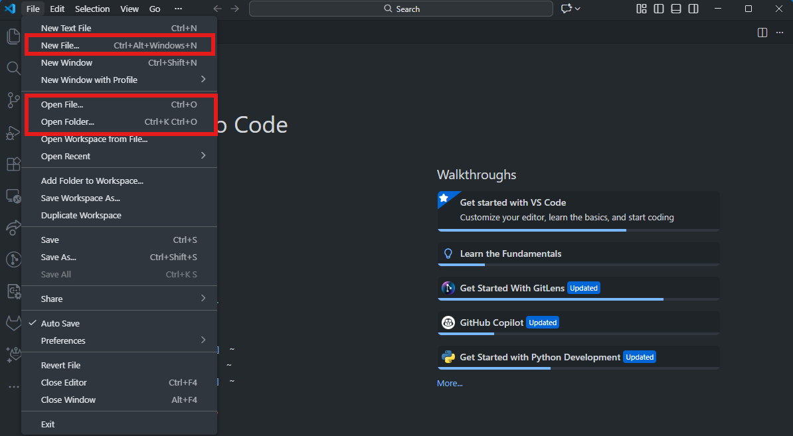
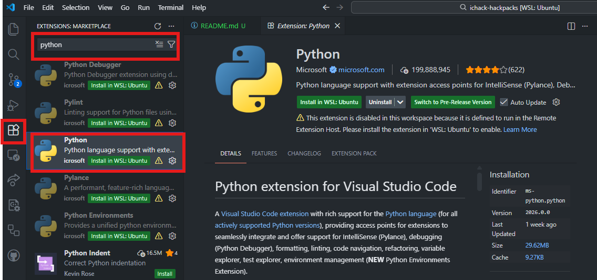
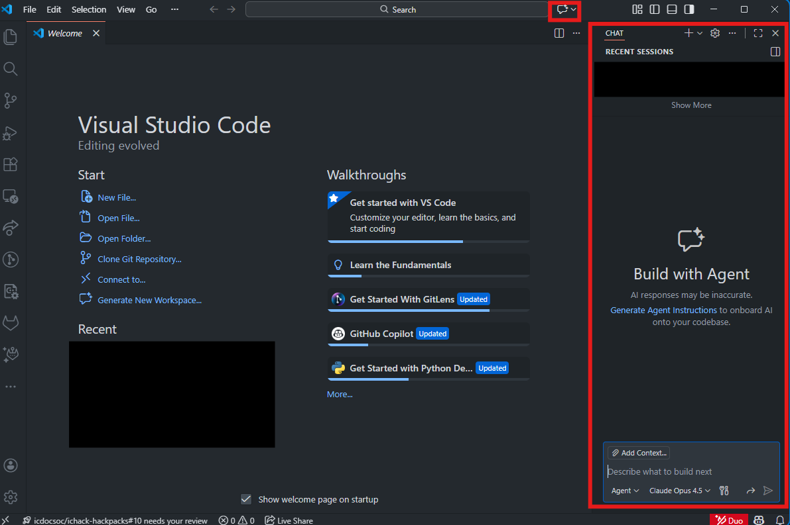
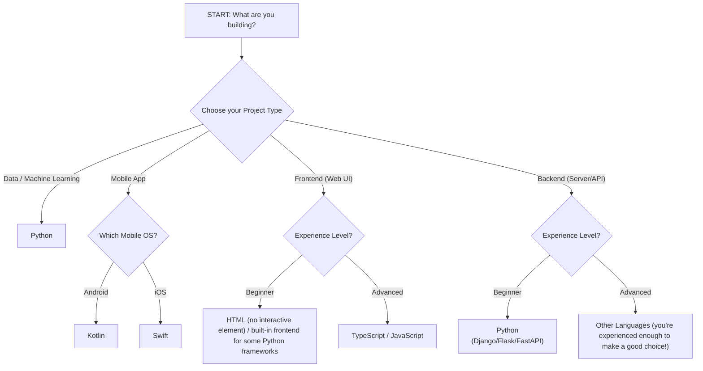

# Getting Started

Welcome to IC Hack! Get ready for **24 hours** of *intense* coding. Every year, our hackers come from different backgrounds and all kinds of prior programming experience. Some of you may be experienced programmers who've been to many hackathons before while some may be complete beginners; this HackPack aims to get your **technical setup ready for hacking**, especially if you have not coded before!

## Table of contents

- [Getting Started](#getting-started)
  - [Table of contents](#table-of-contents)
  - [Setting up an IDE](#setting-up-an-ide)
    - [Visual Studio Code](#visual-studio-code)
  - [Choosing a programming language](#choosing-a-programming-language)
  - [Setting up programming languages](#setting-up-programming-languages)
    - [Python](#python)
    - [JavaScript / TypeScript](#javascript--typescript)
  - [Useful terminal commands](#useful-terminal-commands)
  - [Other useful resources](#other-useful-resources)
  - [Recommended HackPacks for further reading](#recommended-hackpacks-for-further-reading)

## Setting up an IDE

An Integrated Development Environment (IDE) is a software application that provides and combines the necessary tools for programming, like code editor, debugger, compiler, and more, into a single graphical user interface. Generally, we write our code in IDEs rather than plain text editors as it can increase programmer productivity with the tools.

We **recommend** using [Visual Studio Code (VS Code)](#visual-studio-code) for development which is also fairly easy to setup.

> [!NOTE]
> If you are a complete beginner to programming, we would recommend you read the later section on [choosing a programming language](#choosing-a-programming-language) first; if you wish to use JVM languages (e.g. Java, Kotlin, Scala) then you should consider using [IntelliJ IDEA](https://www.jetbrains.com/idea/), or in the case of Android Development using Kotlin, [Android Studio](https://developer.android.com/studio). For other use cases, Visual Studio Code is fine.

### Visual Studio Code

> [!IMPORTANT]
> Part of this material is adapted from the [VS Code Docs](https://code.visualstudio.com/docs/getstarted/getting-started).

1. [Install VS Code](https://code.visualstudio.com/Download) according to your operating system (for most people, this will be Windows or macOS).
2. Follow the instructions on the installer. When you launch VS Code post-installation, it should look similar to this: 
3. Feel free to try opening/creating a new file and start coding! 
4. Once you get VS Code up and running, we recommend installing a few more pieces of software and plugins:
   - [Git](https://git-scm.com/install/). Follow the instructions on the installer. For detailed use of Git, check out [our HackPack](../git-&-github/README.md). On VS Code, we use the **Source Control** feature to manage Git (the third icon on the left hand sidebar).
   - **Extensions** for whichever programming languages you use. For example, if you want to install the extension for Python, you can go to the Extension icon on the left hand sidebar and search for `Python`: 
   - Access to your favourite **LLMs**! VS Code has GitHub Copilot *built-in* from an icon on the top bar:  You can integrate other LLMs into VS Code through the extensions as well: `Codex` for OpenAI (ChatGPT), `Claude Code for VS Code` for Anthropic (Claude), `Gemini Code Assist` for Google (Gemini). If you don't mind setting up API keys, then `Cline` is a good one as well. See our [prompt engineering HackPack](../prompt-engineering/README.md) for more info on how to get the most of those LLMs!

## Choosing a programming language

Now we have our IDE set up, we can decide what language to use for the rest of IC Hack! The decision tree below can help you choose a suitable language based on your use case:

A lot of this depends as well on the experience level of your teammates, so **make sure to discuss** the choice of language/frameworks between yourselves.

## Setting up programming languages

### Python

*First*, [download the installer](https://www.python.org/downloads/).

If you want to install individual Python packages (these may be ones you see in our other HackPacks for machine learning, backend development, etc.), you can do so with the terminal command `pip install <package-name>`.

Alternatively, you can list all the packages and the versions that you wish to install in a file named `requirements.txt`, and then do `pip install -r requirements.txt` to install all the listed packages.

### JavaScript / TypeScript

Scroll down on the [`node.js` download page](https://nodejs.org/en/download) until you see "*Or get a prebuilt Node.js for Windows running a x64 architecture*". Switch the operating system and architecture to your computer's *before* downloading the installer.

This allows you to run JavaScript applications (in frameworks like React), and most importantly you get the `npm` package manager (similar to `pip` in Python) for external packages.

To install individual packages, run `npm install <package-name>`.

Similar to `requirements.txt` in Python, you might also have a `package.json` file that lists all the required packages and versions, then run `npm install` to install all the listed packages.

## Useful terminal commands

As programmers, we often have to work with the terminal to perform various tasks. You therefore might find some of these commands useful. They work on both the Windows PowerShell and macOS Terminal.

> [!WARNING]
> If you're on Windows, don't get the *PowerShell* mixed up with *Command Prompt*. They are **different** applications!

| Action | Command |
| --- | --- |
| Show current folder | `pwd` |
| List files in current location | `ls` |
| Change to a different folder/directory | `cd [folder_name]` |
| Go back to parent folder/directory | `cd ..` |
| Make new folder | `mkdir [folder_name]` |
| Delete file | `rm [filename]` |
| Move file | `mv [filename] [folder_name]` |
| Copy file | `cp [filename] [folder_name]` |
| Run multiple commands at once | `[command_1] && [command_2]` |

For Git-specific commands, refer back to our [Git HackPack](../git-&-github/README.md)!

## Other useful resources

- [Read the HackPacks](../README.md) that may be relevant to your project!
- Use our **Discord**. We have *mentors on-call* throughout to help you in `#coach-support`!
- Make good use of Google, [Stack Overflow](https://stackoverflow.com/) and your favourite LLMs to answer your technical questions if you're unable to reach us.

## Recommended HackPacks for further reading

- Backend development: [API Design](../api-design/README.md), [Databases](../databases/README.md), [Python (Django)](../djangostart/README.md), [Machine Learning](../machine_learning/README.md)
- Frontend development: [ReactJS](../frontend-development/react-example-tutorial/README.md), [Vue.js](../vuejs/README.md)
- Android app development: [Android Development](../android-development/README.md)
- How to get the most out of the hackathon: [Project planning](../project-planning/README.md), [Engaging with sponsors](../engaging-with-sponsors/README.md)
- Preparing for submission & judging: [Pitching and presenting](../pitching-and-presenting/README.md), [DevPost submission guide](../making-a-devpost/README.md)
