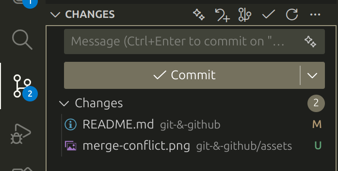
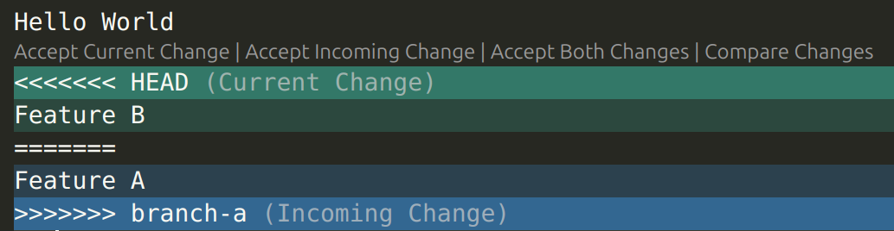

# Git & Github

In this guide, we wlll cover the basics for git, useful features on github, and some advice for using them as a team.

## What is Git? What is the point?

Git is a popular version control system. Git is often used to work on code with others. Git also allows you to save an entire history of your codebase, go back to points in history, selectively undo changes and more. Git stores this information in the `.git` folder.

### Key Git Concepts

- **Repository**: A folder where Git tracks your project and its history.
- **Clone**: Make a copy of a remote repository on your computer.
- **Stage**: Tell Git which changes you want to save next.
- **Commit**: Save a snapshot of your staged changes.
- **Branch**: Work on different versions or features at the same time.
- **Merge**: Combine changes from different branches.
- **Pull**: Get the latest changes from a remote repository.
- **Push**: Send your changes to a remote repository.

### How to Install

You can download Git for free from [git-scm.com](https://git-scm.com). You will need to enter your email after installation.

Afterwards, you will be able to use Git from your terminal or command prompt.

You will likely be prompted to setup your account before you do anything with Git. Simply run the following commands
```bash
git config --global user.name "Your Name"
git config --global user.email "you@example.com"
```

## Git Basics

This section covers the most common Git commands you’ll use during the hackathon. You don’t need to know everything—just enough to collaborate smoothly.

### 1. Create or Clone a Repository

To start off, you can create a new repository on github and share it with your teammates.

1. Go onto the main page of the repository and click `<> Code`. Then, copy the url for the repository.


2. Open Git Bash.

3. Change the current working directory to the location where you want the cloned directory.

4. Type git clone, and then paste the URL you copied earlier.

```bash
git clone https://github.com/YOUR-USERNAME/YOUR-REPOSITORY
```
5. Press Enter to create your local clone.
```bash
$ git clone https://github.com/YOUR-USERNAME/YOUR-REPOSITORY
> Cloning into `Spoon-Knife`...
> remote: Counting objects: 10, done.
> remote: Compressing objects: 100% (8/8), done.
> remove: Total 10 (delta 1), reused 10 (delta 1)
> Unpacking objects: 100% (10/10), done.
```
### 2. Make a commit

After you have cloned the repo, make some changes. You can then stage these changes using 
```bash
git add .
```
which will stage all your changes. 

Then you can run 
```bash
git commit -m "example commit message"
``` 
which will save your changes locally.

If you do not want to commit all your changes, 
```bash
git add
``` 
can be used selectively to add only files you are interested in. You can also add certain file extensions and folders to a `.gitignore` file to ensure they are never tracked.

You can use 
```bash
git status
``` 
at any time to check the state of your working directory and see which files are modified, staged, or untracked.

### 3. Pushing and pulling

Before working with a remote repository, it’s important to ensure that your local clone is up to date. Running 
```bash
git pull
``` 
updates your current local branch by fetching and merging the latest commits from the corresponding remote branch on GitHub.

After you have implemented a feature or fixed a bug, you should upload your local commits to the remote repository. Running 
```bash
git push
``` 
sends all commits from your local branch to the corresponding branch on the remote.

> [!TIP]
> Make sure to run `git pull` everytime before you run `git push` to ensure your local branch is up to date and most importantly to avoid merge conflicts!

Since you are likely using an IDE to code your ICHack submission, you can utilise the inbuilt tools to make commiting changes simple. 

For VSCode, any changes you make since the last commit will be shown in the left hand panel by clicking on the graph symbol.



You can stage a modified file by pressing the `+` as you hover over it. You can also preview the changes by clicking on the file in that panel, and even revert the changes!

To commit your staged changes, write your commit message at the top of the panel and click `Commit`. 

Once committed, that `Commit` button becomes a `Sync Changes`. This automatically `pull`s then `push`es your changes!

### 4. Checkout and Branch
Branches allow you to work on new features or bug fixes without affecting the main codebase. This makes collaboration safer and more organized.

To see all available branches, you can run 
```bash
git branch
```
Branches name will be shown and the one you are checking out right now will be highlighted with an asterisk (`*`)

To create and switch to a new branch, run 
```bash
git checkout -b branch-name
``` 
to create a new branch and immediately check it out. 

>[!WARNING]
> This command creates a new branch that originates at the currently checked-out branch. Ensure that you are on the right branch
> Alternatively, specify the source
> ```bash
> git checkout -b branch-name source-branch
> ```

If you only want to create a new branch without switching to it, instead run 
```bash
git branch branch-name
```

If you want to switch to any existing branch, run 
```bash
git checkout branch-name
```  

Since we are using Git to work collaboratively, it is useful to know how to create branches on the *remote*. This is just your branch being published to GitHub (most likely!), so your teammates can see your work and contribute alongside.

Once you have created your *local* branch, simply run
```bash
git push -u origin branch-name
```

If you **already** have a remote branch, that you want to have as a *local* branch, run
```bash
git fetch
git checkout -b branch-name --track origin/remote-branch-name
```

To easily see the list of remote branches, run
```bash
git fetch
git branch -r
```

---

Sometimes Git might block your checkout if you have uncommitted changes that would be overwritten and shows 

```bash
error: Your local changes to the following files would be overwritten by checkout
```
If you want to switch branches and have received this error, you can:

**1. Commit your change**
This is straightforward as you just commit all your changes to remote. 
```bash
git add .
git commit -m "your commit message"
```
**2. Stash your changes**
If you don't want to commit your changes yet but still want to save your progress, you can stash your change. **Stashing** means git saves your changes on a stack and temporally revert all the changes so that you can switch branches or do other changes safely. 
```bash
git stash #This will save your progress
git checkout branch-name
git stash pop #If you want to retrieve your progress, you can pop it out from the stack
```

**3. Discard your change (irreversible)**
If you want to discard all the changes you made, you can:
```bash
git reset --hard
```

### 5. Merge branches
Once your work on a branch is complete and tested, you can merge it back into another branch (usually main or master).


```bash
git checkout main                   #First, switch to the branch you want to merge into
git pull                            #Make sure it is up to date before merging
git merge feature-branch-name       #Then merge your feature branch into main
```
If there are no conflicts, Git will automatically complete the merge. If conflicts occur, Git will prompt you to resolve them manually before completing the merge. If you are using any IDE like VS code, they usually provide a conflict editor.
After all conflicts are resolved, your branch will now be successfully merged into main.
After a successful merge, you can optionally delete the feature branch:
```bash
git branch -d feature-branch-name
```

Alternatively, you can use **Pull Requests** on GitHub to merge branches into main. This is considered best practice, as it allows teammates to review the changes, provide feedback, and approve the merge before it is completed.

>[!TIP]
> Try to keep branches small, ideally one branch should be one feature!
> 
> Large branches can cause serious merge conflicts!

#### Merge Conflicts

In the ***very*** unfortunate scenario that you have merge conflicts that Git can't automatically resolve, it is up to you to fix it!

Here is an example of what you will see in a file with a merge conflict
```
Hello World
<<<<<<< HEAD
Feature B
=======
Feature A
>>>>>>> branch-a
```

The bits between `HEAD` and the `=======` denote the code that is on your branch. The bit between the `=======` and `branch-name` are the incoming changes. 

To resolve, you must remove all of the below characters in a text editor
```
<<<<<<< HEAD
=======
>>>>>>> branch-a
```

And you must also resolve the conflict as you see fit! This typically involves either keeping your change, the incoming change, both, or a mix of both. 

This process can be made simpler through the use of GitHub's UI, which will highlight these conflicts.

Many of you will be using VSCode as your IDE *(or text editor, whatever...)* of choice. 



You will see the above when you open a file with a current merge conflict. You can press the buttons above the conflict to quickly resolve.

To finalise the resolution of a merge conflict, you must commit all the files whose merge conflicts you have resolved. 

### 6. Undo Mistakes
If you have made serious mistakes since the last commit, you can run the following to reset a single file to the version that was last committed
```bash
git restore <file> 
```

For more serious mistakes, you may want to reset your whole branch to the last commit made
```bash
git reset --hard 
```

If you want to change the commit message of the previous change, run
```bash
git commit --amend
```

If you forgot to add a file to a commit, just run
```bash
git add <file>
git commit --amend
```

Don't like the changes made in a specific commit? Run
```bash
git revert <commit>
```

The `<commit>` is a commit hash, a unique identifier for a commit. These can be found by running 

```bash
git log
```

This prints the entire history of that branch.
>[!IMPORTANT]
> The full history may be truncated at first. If you see `:` at the bottom of the output, press `Enter` to get the next line. You can press `q` at any time to leave this view and get back to your terminal.

One entry in the log will look like
```bash
commit 8d0fae1dc9da67058f27e86ee4e2b3f7c474a3fb (origin/git-github)
Author: Timofey Kolesnichenko <tk1124@ic.ac.uk>
Date:   Fri Jan 9 14:01:07 2026 +0000

    Fix: Cleanup some of the formatting and fix typos.
```
where the `8d0fae1...` is the commit hash.

>[!TIP]
> Git is smart! You don't need the *full* commit hash in order to reference the commit. The first 7 characters are typically sufficient. You may need an 8th or 9th if there happen to be clashes!

>[!IMPORTANT]
> `git revert <commit>` does not delete any history or the changes made. 
> This simply creates a new commit that undoes the changes made in commit `<commit>`

Want to completely remove a commit but keep the changes?
```bash
git reset --soft HEAD~1
```

In fact, you can remove the previous `N` commits using
```bash
git reset --soft HEAD~N
```

All the changes made in those commits will still be present as local, unstaged changes. 


Once you are happy, you need to `push` your changes to remote so your teammates can be on the same page.

Since the above actions are destructive (apart from `revert`), you will need to use 
```bash
git push --force
```

>[!WARNING]
> Ensure your teammates do not push any changes while you are force-pushing! 

>[!IMPORTANT]
> For your teammates to see changes, they must `pull`!

[See here](#useful-links) for 2 good websites that have information on how to deal with practically any issue with Git.


## Useful Features

### Pull Request

A **Pull Request (PR)** is a way to propose changes to a repository and request that those changes be reviewed and merged into another branch (usually main).

In ICHACK or any team projects, it is well recommended to use PR instead of git-merge for merging branches. PR can allow your teammates to quickly review changes and catch bugs early, which can save you time to debug later.

#### How to create a PR

1. On GitHub, navigate to the main page of the repository.
2. In the "Branch" menu, choose the branch that contains your commits.

3. Above the list of files, in the yellow banner, click Compare & pull request to create a pull request for the associated branch.

4. Use the *base* branch dropdown menu to select the branch you'd like to merge your changes into, then use the compare branch drop-down menu to choose the topic branch you made your changes in.
5. Type a title and description for your pull request.

After your teammates have reviewed your PR, you will then safely merge it to main.

[comment]: <> (Maybe include how to merge PR as well)
[comment]: <> (Has been included under 5. Merge branches)

### Issues

An **Issue** is used to track tasks, bugs, feature requests, or discussions related to a repository.

Although ICHACK focuses on shor-term projects, Github issues can be useful as a TO-Do list or Group Discussion about a new feature.

Creating this type of issue can save your brainstroming process which will be helpful when writing your pitches or explain to the judges thinking process.

#### How to Create an Issues

1. On GitHub, navigate to the main page of the repository.

2. Click the Issues tab at the top of the page.


3. Click New issue.

4. If your repository uses issue templates, next to the type of issue you'd like to open, click Get started.

    If the type of issue you'd like to open isn't included in the available options, click Open a blank issue.

    

5. Enter a clear and descriptive title.

6. Use the description to explain:

    - What needs to be done, fixed, or discussed

    - Any relevant context or ideas

7. (Optional) Assign the Issue to a teammate and add labels such as bug, feature, or task.

8. Click Submit new issue.

## How to use Git as a team?

## Useful links

- [dangitgit](https://dangitgit.com/en) and [Oh Shit, Git!?!](https://ohshitgit.com/) are good places to go if something has gone terribly wrong.
- [Learn Git Branching](https://learngitbranching.js.org/) is a visual gamified way to learn git.
- [Setting up an SSH key](https://docs.github.com/en/authentication/connecting-to-github-with-ssh/generating-a-new-ssh-key-and-adding-it-to-the-ssh-agent) is a way to make authentication easier when pushing commits.
