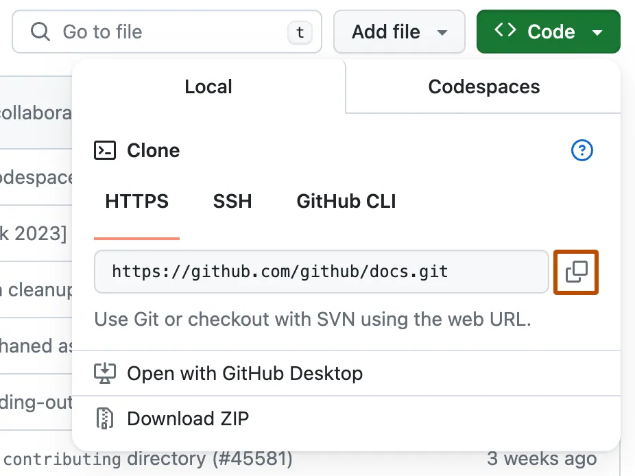
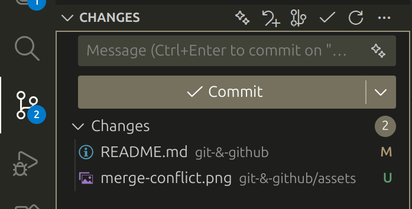
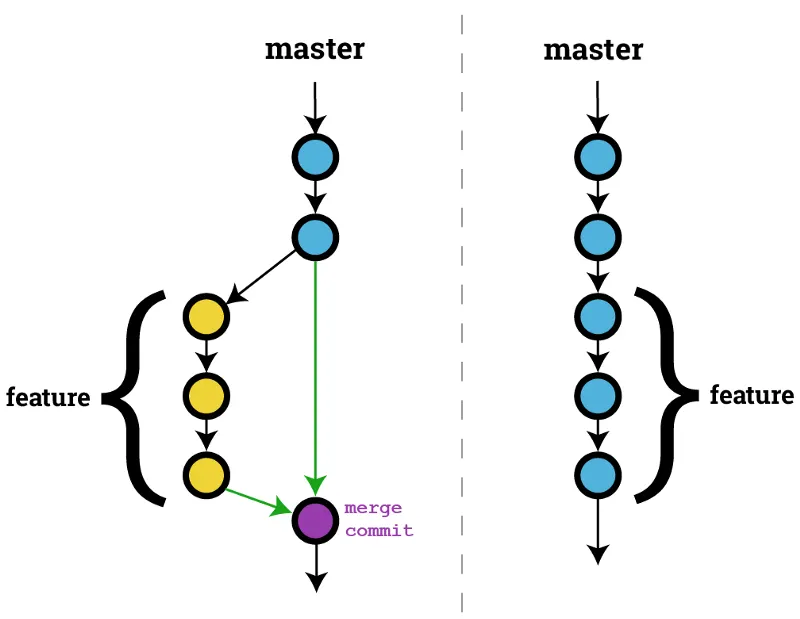
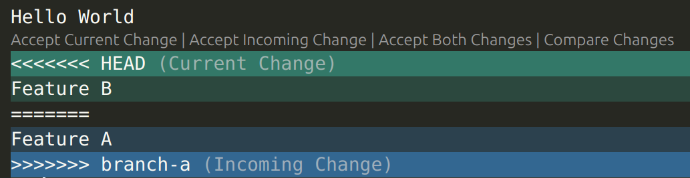
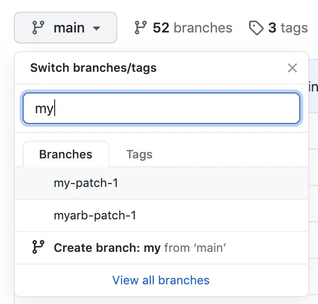
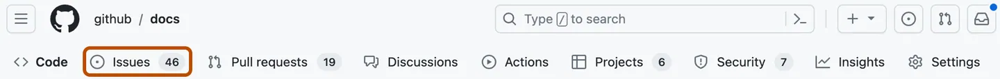

# Git & GitHub

In this guide, we will cover the basics of Git, useful features on GitHub, and some advice for using these two tools as a team.

## Table of Contents

<!-- TOC -->

- [Git \& GitHub](#git--github)
  - [Table of Contents](#table-of-contents)
  - [What is Git? What is the point?](#what-is-git-what-is-the-point)
    - [Key Git Concepts](#key-git-concepts)
    - [How to Install](#how-to-install)
  - [Git Basics](#git-basics)
    - [1. Create or Clone a Repository](#1-create-or-clone-a-repository)
    - [2. Make a commit](#2-make-a-commit)
    - [3. Pushing and pulling](#3-pushing-and-pulling)
    - [4. Checkout and Branch](#4-checkout-and-branch)
      - [Remote branches](#remote-branches)
      - [A common error](#a-common-error)
        - [1. Commit your changes](#1-commit-your-changes)
        - [2. Stash your changes](#2-stash-your-changes)
        - [3. Discard your changes (*irreversible*)](#3-discard-your-changes-irreversible)
    - [4. Merge branches](#4-merge-branches)
      - [Merge Conflicts](#merge-conflicts)
    - [5. Undo Mistakes](#5-undo-mistakes)
  - [Useful Features](#useful-features)
    - [Pull Request](#pull-request)
      - [How to create a PR](#how-to-create-a-pr)
    - [Issues](#issues)
      - [How to Create an Issue](#how-to-create-an-issue)
  - [How to use Git as a team?](#how-to-use-git-as-a-team)
    - [1. Conventional commit messages](#1-conventional-commit-messages)
      - [What is a `<type>`?](#what-is-a-type)
    - [2. Make Small, Focused Commits](#2-make-small-focused-commits)
    - [3. Agree on a branching strategy](#3-agree-on-a-branching-strategy)
  - [Useful links](#useful-links)

<!-- /TOC -->

## What is Git? What is the point?

Git is a **popular what is version control system**, which tracks and manages changes to files (like source code) over time, creating a complete history, enabling collaboration, and allowing developers to revert to previous versions if errors occur.

Git is often used to work on code with others. It also allows you to save the entire history of your codebase, go back to points in history, selectively undo changes and more. Git stores this information in the `.git` folder of a repository.

There are other version control systems such as SVN and Mercurial. However, since Git is decentralized, more flexible than these systems, and widely used in the industry, we will focus only on Git here.

### Key Git Concepts

- **Repository**: A folder where Git tracks your project and its history.
- **Clone**: Make a copy of a remote repository on your computer.
- **Stage**: Tell Git which changes you want to save next.
- **Commit**: Save a snapshot of your staged changes.
- **Branch**: Mechanism which allows you to work on different versions or features at the same time.
- **Merge**: Combine changes from different branches.
- **Pull**: Get the latest changes from a remote repository.
- **Push**: Send your changes to a remote repository.

### How to Install

You can **download Git for free** from [git-scm.com](https://git-scm.com). You will need to enter your email after installation.

Afterwards, you will be able to use Git from your terminal or command prompt.

You will likely be prompted to setup your account before you do anything with Git. Simply run the following commands.

```bash
git config --global user.name "Your Name"
git config --global user.email "you@example.com"
```

## Git Basics

This section covers the most common Git commands you’ll use at IC Hack. You don’t need to know everything—just enough to collaborate smoothly.

### 1. Create or Clone a Repository

To start off, you can create a new repository on GitHub and share it with your teammates.

1. Go onto the main page of the repository and click `<> Code`. Then, copy the url for the repository.


2. Open Git Bash.

3. Make sure the terminal's current working directory is the location you want the cloned repository to exist in.

4. Type `git clone`, and then paste the URL you copied earlier.

    ```bash
    git clone https://github.com/YOUR-USERNAME/YOUR-REPOSITORY
    ```

5. Press Enter to create your local clone.

    ```bash
    $ git clone https://github.com/YOUR-USERNAME/YOUR-REPOSITORY
    > Cloning into `Spoon-Knife`...
    > remote: Counting objects: 10, done.
    > remote: Compressing objects: 100% (8/8), done.
    > remove: Total 10 (delta 1), reused 10 (delta 1)
    > Unpacking objects: 100% (10/10), done.
    ```

### 2. Make a commit

After you have cloned the repo, make some changes. You can then stage them using the command:

```bash
git add .
```

Then, you can run

```bash
git commit -m "example commit message"
```

which will save your changes locally.

If you do not want to commit all your changes,

```bash
git add [filename]
```

can be used selectively to add only files you are interested in. You can also add certain file extensions and folders to a `.gitignore` file to ensure they are **never tracked**. Place the `.gitignore` file in the root of your repo. You may also want to refer to [the documentation and template `.gitignore` files](https://docs.github.com/en/get-started/git-basics/ignoring-files?platform=linux).

Here is an example stolen from the Git docs:

```bash
# ignore all .a files
*.a

# but do track lib.a, even though you're ignoring .a files above
!lib.a

# only ignore the TODO file in the current directory, not subdir/TODO
/TODO

# ignore all files in any directory named build
build/

# ignore doc/notes.txt, but not doc/server/arch.txt
doc/*.txt

# ignore all .pdf files in the doc/ directory and any of its subdirectories
doc/**/*.pdf
```

You can use

```bash
git status
```

at any time to check the state of your working directory and see which files are modified, staged, or untracked.

### 3. Pushing and pulling

Before working with a remote repository, it’s important to ensure that your **local clone is up to date**.

Running

```bash
git pull
```

updates your current local branch by fetching and merging the latest commits from the corresponding remote branch on GitHub.

After you have implemented a feature or fixed a bug, you should upload your local commits to the remote repository.

Running

```bash
git push
```

sends all commits from your local branch to the corresponding branch on the remote.

> [!TIP]
> Make sure to run `git pull` everytime before you run `git push` to ensure your local branch is up to date and most importantly to avoid merge conflicts!

Since you will likely be using an IDE for your IC Hack project, you can utilise the inbuilt version control tools to make commiting changes simple.

For VSCode, any changes you make since the last commit will be shown in the left hand panel by clicking on the graph symbol.



You can stage a modified file by pressing the `+` as you hover over it. You can also preview the changes by clicking on the file in that panel, and even revert the changes!

To commit your staged changes, write your commit message at the top of the panel and click `Commit`.

Once committed, that `Commit` button becomes `Sync Changes`. This automatically pulls then pushes your changes!

> ![TIP]
> You can also click the drop-down arrow next to the `Commit` button if you would like to `Commit and Sync` or `Commit and Push` together!

### 4. Checkout and Branch

Branches allow you to work on new features or bug fixes without affecting the main codebase. This makes **collaboration safer and more organised**.

To see all available branches, you can run:

```bash
git branch
```

Branch names will be shown and the one you are 'checking out' right now will be highlighted with an asterisk (`*`).

To create and switch to a new branch, run

```bash
git checkout -b branch-name
```

to create a new branch and immediately check it out.

>[!WARNING]
> This command creates a new branch that originates at the currently checked-out branch. Ensure that you are on the right branch.
>
> Alternatively, specify the source
>
> ```bash
> git checkout source-branch
> git checkout -b branch-name
> ```

If you only want to create a new branch without switching to it, instead run

```bash
git branch branch-name
```

If you want to switch to any existing branch, run

```bash
git checkout branch-name
```  

#### Remote branches

Since we are using Git to work collaboratively, it is useful to know how to create branches on the *remote*. This is just your branch being published to GitHub (most likely!), so your teammates can see your work and contribute alongside.

Once you have created your *local* branch, simply run

```bash
git push -u origin branch-name
```

If you **already** have a remote branch, that you want to clone as a *local* branch, run

```bash
git fetch
git checkout remote-branch-name
```

To easily see the list of remote branches, run

```bash
git fetch
git branch -r
```

#### A common error

Sometimes Git might block your branch checkout if you have uncommitted changes that would be overwritten and shows

```txt
error: Your local changes to the following files would be overwritten by checkout
```

If you want to switch branches and receive this error, you can:

##### 1. Commit your changes

This is straightforward as you just commit all your changes to remote.

```bash
git add .
git commit -m "your commit message"
```

##### 2. Stash your changes

If you don't want to commit your changes yet but still want to save your progress, you can stash your change. **Stashing** means git saves your changes on a stack and temporally revert all the changes so that you can switch branches or do other changes safely.

```bash
git stash #This will save your progress
git checkout branch-name
git stash pop #If you want to retrieve your progress, you can pop it out from the stack
```

##### 3. Discard your changes (*irreversible*)

If you want to discard all the changes you made, you can:

```bash
git reset --hard
```

### 4. Merge branches

Once your work on a branch is complete and tested, you can merge it back into another branch (usually `main` or `master`).



```bash
git checkout main                   # First, switch to the branch you want to merge into
git pull                            # Make sure it is up to date before merging
git merge feature-branch-name       # Then merge your feature branch into main
```

If there are no conflicts, Git will automatically complete the merge. If conflicts occur, Git will prompt you to resolve them manually before completing the merge. If you are using any IDE like VS code, they usually provide a **conflict editor**.

After all conflicts are resolved, your branch will now be successfully merged into `main`.

After a successful merge, you can optionally delete the feature branch:

```bash
git branch -d feature-branch-name
```

Alternatively, you can use **Pull Requests** on GitHub to merge branches into main.

This is considered best practice, as it allows teammates to review the changes, provide feedback, and approve the merge before it is completed.

>[!TIP]
> Try to keep branches small, ideally one branch should be one feature!
>
> Large branches can cause serious merge conflicts!

#### Merge Conflicts

In the *very* unfortunate scenario that you have merge conflicts that Git can't automatically resolve, it is up to you to fix it!

This is what you could see in a file with a merge conflict:

```txt
Hello World
<<<<<<< HEAD
Feature B
=======
Feature A
>>>>>>> branch-a
```

The text between `HEAD` and `=======` denote the code on your branch. The text between `=======` and `branch-a` are the incoming changes.

To resolve, you must remove all of the below characters in a text editor

```txt
<<<<<<< HEAD
=======
>>>>>>> branch-a
```

And you must also resolve the conflict as you see fit! This typically involves either keeping your change, the incoming change, both, or a mix of both.

This process can be made *much simpler* through the use of GitHub's UI, which will highlight these conflicts.

Many of you will be using VSCode as your IDE *(or text editor, whatever...)* of choice.



You will see the above when you open a file with a current merge conflict. You can **press the buttons** above the conflict to quickly resolve conflicts on an individual basis, or across an entire file.

To finalise the resolution of a merge conflict, you must commit all the files whose merge conflicts you have resolved.

### 5. Undo Mistakes

If you have made serious mistakes since the last commit, you can run the following to reset a single file to the version that was last committed

```bash
git restore <file> 
```

For more serious mistakes, you may want to reset your whole branch to the last commit made

```bash
git reset --hard 
```

If you want to change the commit message of the previous change, run

```bash
git commit --amend
```

If you forgot to add a file to a commit, just run

```bash
git add <file>
git commit --amend
```

Don't like the changes made in a specific commit? Run

```bash
git revert <commit>
```

The `<commit>` is a commit hash, a unique identifier for a commit. These can be found by running

```bash
git log
```

or by copying the commit hash from the GitHub website.

This prints the entire history of that branch.
>[!IMPORTANT]
> The full history may be truncated at first. If you see `:` at the bottom of the output, press `Enter` to get the next line. You can press `q` at any time to leave this view and get back to your terminal.

One entry in the log could look something like:

```txt
commit 8d0fae1dc9da67058f27e86ee4e2b3f7c474a3fb (origin/git-github)
Author: Timofey Kolesnichenko <tk1124@ic.ac.uk>
Date:   Fri Jan 9 14:01:07 2026 +0000

    Fix: Cleanup some of the formatting and fix typos.
```

where the `8d0fae1...` is the commit hash.

>[!TIP]
> Git is smart! You don't need the *full* commit hash in order to reference the commit. The first 7 characters are typically sufficient. You may need an 8th or 9th if there happen to be clashes!

>[!IMPORTANT]
> `git revert <commit>` does not delete any history or the changes made.
> This simply creates a new commit that undoes the changes made in commit `<commit>`

Want to completely remove a commit but keep the changes?

```bash
git reset --soft HEAD~1
```

In fact, you can remove the previous `N` commits using

```bash
git reset --soft HEAD~N
```

All the changes made in those commits will still be present as local, unstaged changes.

Once you are happy, you need to `push` your changes to remote so your teammates can be on the same page.

Since the above actions are destructive (apart from `revert`), you will need to use

```bash
git push --force
```

>[!WARNING]
> Ensure your teammates do not push any changes while you are force-pushing!

>[!IMPORTANT]
> For your teammates to see the changes you push, they must `pull`!

> [!TIP]
> The websites [linked below](#useful-links) have information on how to deal with practically any issue within Git.

## Useful Features

### Pull Request

A **Pull Request (PR)** is a way to propose changes to a repository and request that those changes be reviewed and merged into another branch (usually main).

In IC Hack or other team projects, it is recommended to use PR instead of git-merge for merging branches. PR can allow your teammates to quickly review changes and catch bugs early, which can save you time to debug later.

#### How to create a PR

1. On GitHub, navigate to the homepage of the repository.
2. In the "Branch" menu, choose the branch that contains your commits.

3. Above the list of files, in the yellow banner, click `Compare & pull request` to create a pull request for the associated branch.

4. Use the *base* branch dropdown menu to select the branch you'd like to merge your changes into, then use the *compare* branch drop-down menu to choose the topic branch you made your changes in.
5. Come up with a title and description for your pull request.

After your teammates have reviewed your PR, you should then be able to successfully merge it to main.

### Issues

An **Issue** is used to track tasks, bugs, feature requests, or discussions related to a repository.

Although IC Hack projects generally have a shorter timeline, GitHub issues can still be useful as a ***TODO* list** or for **group discussion** about a new feature.

Creating this type of issue can record your brainstroming process, which will be helpful when writing your pitches or explaining your thinking process to the judges.

#### How to Create an Issue

1. On GitHub, navigate to the main page of the repository.

2. Click the `Issues` tab at the top of the page.


3. Click `New issue`.

4. Enter a clear and descriptive title.

5. Use the description to explain:

    - What needs to be done, fixed, or discussed

    - Any relevant context or ideas

6. (*Optional*) Assign the Issue to a teammate and add labels such as bug, feature, or task.

7. Click `Submit new issue`.

## How to use Git as a team?

### 1. Conventional commit messages

Although this sounds like a hassle, writing conventional commit messages is actually very useful when **working in a team**. Conventional commit messages help your teammates understand what changed in that commit, quickly. This will be helpful if you want to go back to a specific commit or ask your teammates about a change in a commit they did.

A good conventional commit message should look like this:

```text
<type>[optional scope]: <description>

Co-authored-by: AAA <ic@hack.com>
Co-authored-by: BBB <hack@ic.com>
```

#### What is a `<type>`?

Some common types are ``fix:`` and ``feat:``, which representing fixing a bug and introduce a new feature respectively. Some other types are ``build:``, ``chore:``, ``ci:``, ``docs:``, ``style:``, ``refactor:``, ``perf:``, ``test:``, and others.

### 2. Make Small, Focused Commits

Always commit with small changes or a single feature. When commiting with a lot of features or changes, it can be hard to debug if just one of those changes causes an error.

*A bad example*:

```txt
feat: login, fix tests, formatting, random cleanup
```

In this example we included a lot of features in different scopes. This will make this commit hard to maintain and debug if we are trying to undo or fix one of the features.

*A better example:*

```bash
feat(login): add email validation
fix(login): prevent crash on empty password
style(login): run formatter
```

In this example, we have split the changes into small commits so it would be easier to review and revert.

### 3. Agree on a branching strategy

Most teams should have an "always deployable" `main` branch and short-lived branches that will be merged into `main` once finished.

```bash
main        → always deployable
feature/*   → short-lived branches
```

Your team could also establish some rules to maintain branching:

- Never commit directly to `main`
- Merge via Pull Requests
- Delete branches after merge

## Useful links

- [dangitgit](https://dangitgit.com/en) and [Oh Shit, Git!?!](https://ohshitgit.com/) if you need to fix something that's gone terribly wrong.
- [Learn Git Branching](https://learngitbranching.js.org/) for a visual gamified way to learn Git.
- [Setting up an SSH key](https://docs.github.com/en/authentication/connecting-to-github-with-ssh/generating-a-new-ssh-key-and-adding-it-to-the-ssh-agent) to make authentication easier when pushing commits.
- [Conventional commits](https://www.conventionalcommits.org/en/v1.0.0/) for a detailed explaination on writing good conventional commit messages.
