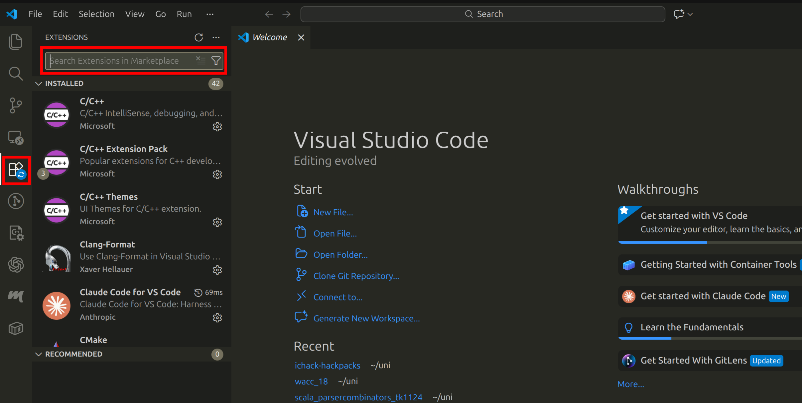
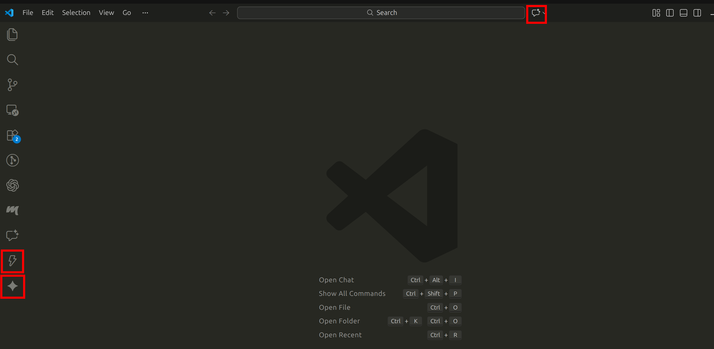
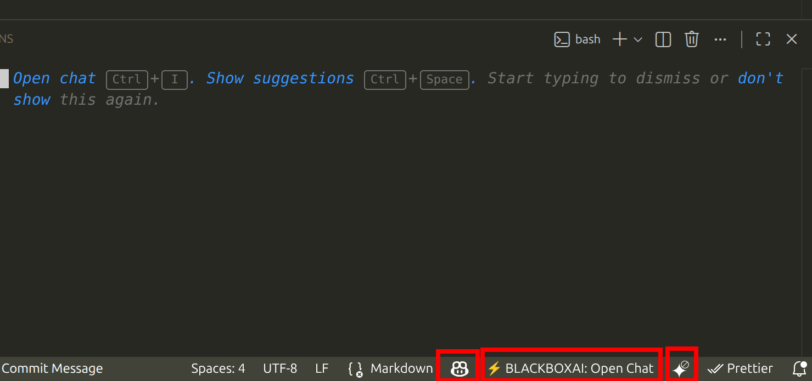

# Prompt Engineering

In this guide you will find useful information about setting up APIs for different LLMs and also how to prompt them effectively.

## What is Prompt Engineering?

Prompt engineering is a new and emerging art of crafting instructions to get LLMs like [ChatGPT](https://chatgpt.com), [Claude](https://claude.ai/), [Gemini](https://gemini.google.com/) and others, to produce the output you want. The better the instructions, the better the results!

## Copy-paste prompts

### Example for Code Review

````txt
Review this [LANGUAGE] code for:
- Bugs and logical errors
- Performance issues
- Security vulnerabilities
- Code style and best practices

Code:
```[LANGUAGE]
[CODE]
```


Provide specific line-by-line feedback.
````

### Project planner

```txt
You are a startup CTO.

My idea:
<DESCRIBE YOUR IDEA>

I have 48 hours.

Generate:
1. Feature set
2. System architecture
3. Folder structure
4. First 5 implementation steps
Keep everything minimal.
```

### Test generation

```txt
You are an expert QA engineer and software tester.

Given this function or module:
<PASTE CODE>

Do the following:

1. Identify all normal cases and edge cases.
2. Generate unit tests covering these cases.
3. Use the language and testing framework specified: <LANGUAGE + FRAMEWORK>.
4. Ensure tests are ready to run (copy-pasteable).
5. Label each test clearly.
6. If the code has potential bugs or risky behavior, include a failing test case to catch it.
```

### UI generation

```txt
You are a senior frontend designer and UX engineer.

We are building:
<PROJECT IDEA>

Do the following:
1. Generate a list of screens/components needed.
2. Suggest a simple component hierarchy.
3. Recommend Tailwind (or CSS) classes for styling.
4. Provide a minimal mobile-first layout plan.
5. Include placeholder content for testing.
```

### Refactor code

```txt
You are an expert software engineer.

Given this code:
<PASTE CODE>

Do the following:
1. Refactor for readability and performance.
2. Add error handling where appropriate.
3. Remove any dead or redundant code.
4. Keep the output minimal and functional.

Return only the improved code.
```

## Core Principles

### 1. Be Specific and Detailed

Vague prompts get vague results. Include details such as the language, format, length, style and constraints.

❌ **Weak:**

```txt
Write a function to sort data
```

✅ **Strong:**

```txt
Write a Python function that takes a list of dictionaries representing users 
(with 'name', 'age', 'score' fields) and returns them sorted by score in 
descending order. Include type hints and a docstring.
```

### 2. Provide Context

Give the LLM all the information it needs. This includes relevant code, error messages, requirements and background.

❌ **Weak:**

```txt
Fix this bug
```

✅ **Strong:**

```txt
I'm getting a "TypeError: 'NoneType' object is not subscriptable" error on line 45.
Here's the relevant code:

[code snippet]

The function should return a dictionary but sometimes gets None from the API call.
How can I handle this case gracefully?
```

### 3. Set the Role / Persona

Tell the LLM what perspective to take. This helps shape the tone, depth and approach.

**Examples:**

- "You are an expert Python developer reviewing code for security vulnerabilities..."
- "Act as a patient teacher explaining React hooks to a beginner..."
- "You are a technical documentation writer creating API reference docs..."

### 4. Use Examples

Show the model what you want with 1-3 examples. This can be incredibly powerful for formatting and style.

**Example:**

```txt
Convert these user inputs into structured JSON:

Input: "Meeting with Sarah tomorrow at 3pm"
Output: {"type": "meeting", "person": "Sarah", "time": "15:00", "date": "tomorrow"}

Input: "Remind me to call the dentist on Friday"
Output: {"type": "reminder", "action": "call", "person": "dentist", "date": "Friday"}

Input: "Lunch with the team next Tuesday at noon"
Output:
```

### 5. Break Down Complex Tasks

❌ **Weak:**

```txt
Build me a complete web scraper that extracts product data, stores it in a database, and generates visualizations
```

✅ **Strong:**

```txt
Write a function to scrape product names and prices from this HTML structure
```

```txt
Now add database insertion using SQLAlchemy for the scraped data
```

```txt
Create a visualization function that plots price trends over time
```

### 6. Specify Output Format

Be explicit about how you want your response to be structured.

**Examples:**

- "Respond only with valid JSON, no explanation"
- "Format your response as a numbered list"
- "Write this as a Git commit message following conventional commits format"
- "Return a Python dictionary with keys: 'status', 'data', 'error'"

### 7. Use Delimiters for Clarity

Use markers to separate different parts of your prompt, especially when including code, error messages or data.

**Example:**

````txt
Analyze this code for bugs:
```python
[your code here]
```

Focus on: null pointer exceptions, array bounds, and type mismatches
````

### 8. Set Constraints and Guardrails

Tell the model explicitly what ***not*** to do or what limits to expect.

**Examples:**

- "Keep your response under 100 words"
- "Don't use any external libraries beyond the Python standard library"
- "Avoid using deprecated jQuery methods"
- "Don't include any placeholder or TODO comments—only working code"

### 9. Iterate and Refine

Your first prompt rarely works perfectly. Treat it more like a conversation:

```txt
Create a REST API endpoint
```

```txt
Add input validation for the email field
```

```txt
Use Pydantic for the validation instead of manual checks
```

## Common Pitfalls to Avoid

- **Being Too Polite** - LLMs don't have feelings, be direct and clear
- **Assuming Context** - The model may not accurately remember past conversation. This is especially true in API calls. Always provide full context.
- **Asking Multiple Unrelated Questions** - Stick to one task per prompt.
- **Ignoring Token Limits** - Very long prompts or requests for large outputs can hit limits and degrade quality. Prefer smaller chunks.

## More Advanced Techniques

### Chain of Thought

For more complex reasoning tasks, ask the LLM to show its work and thought process.

**Example:**

```txt
A store has 15 apples. They sell 40% and then receive a shipment that doubles 
their remaining stock. How many apples do they have now?

Solve this step by step, showing your calculation at each stage.
```

### Comparative Analysis

For important decisions (maybe about the direction of your project), ask the model to consider multiple approaches.

**Example:**

```txt
Propose three different architectures for this microservices system, 
then evaluate the pros and cons of each.
```

### Control techniques

AI's often "reinvent" your code
Use a prompt like this to ensure it stays consistent the whole time:

```txt
For the rest of this conversation, do not change variable names, project architecture, or function signatures unless I explicitly say "ARCHITECTURE RESET".
```

Use a critique loop to refine the solution.

```txt
Step 1: Generate the initial solution for this task:
<TASK DESCRIPTION>

Step 2: Critique your own solution, identifying mistakes or improvements.

Step 3: Produce a final improved version, incorporating all critiques.

Return ONLY the final version, along with a short bullet list of what changed.
```

Ensure the output is in one format

```txt
Return all output in this exact format:
<SPECIFY FORMAT: JSON, markdown table, numbered list, etc.>

Do NOT add explanations or commentary unless asked.
```

## ICHack-Specific Tips

### Rapid Prototyping

- Start with "Create a minimal working example of..."
- Ask for "Quick and dirty" solutions first, optimise later
- Request boilerplate, LLMs often strip it

### Debugging Under Pressure

- Include the full error traceback
- Mention the steps you have already tried
- Ask for multiple potential causes

### For Learning New Tech Fast

- "Explain [TECHNOLOGY] as if I am familiar with [TECHNOLOGY YOU KNOW]"
- Tell the LLM about your technical background
- Request minimal examples: "Show me the simplest way to..."

## IDE Extensions

Tired of `Alt + Tab`bing? You can now do all your LLM-powered work from right within your IDE!

This quick guide will focus on VSCode, but setup is quite similar for JetBrains' products (IntelliJ, PyCharm, etc.).

There are many extensions from all your popular LLM providers:

- Claude Code for VS Code
- Codex - OpenAI
- GitHub Copilot Chat
- Gemini Code Assist
- BlackBox AI

Of the above, the only *free* options are `GitHub Copilot Chat` (with expanded quotas if you have redeemed your free Education Pack...), `BlackBox AI` and Gemini.

>[!WARNING]
> Only install one of these...
> Performance tanks quickly once you install more than one.

The others all require the respective premium memberships for that provider.

We will therefore be talking only about those free LLM extensions.

To install any of these extensions, simply click the `Extensions` button on the left hand side to open the extensions panel. Then search for your LLM extension of choice from the list above.



Once you have found your extension of choice, install it by pressing the `install` button, pressing `restart extensions` if prompted.

Once installed, the extensions will appear in your editor.



In the above screenshot, BlackBox AI is the lightning bolt on the left hand side. Gemini is teh Gemini logo just below the lightning bolt, and Copilot Chat is the chat logo on the top row.

>[!TIP]
> At this point, it is a good idea to restart VSCode to ensure the extensions can fully install

With Gemini, you will be asked to sign in when you open the pane. If you activated your Developer Pack, you should also sign in with GitHub Copilot. Both authentication requests will open a window in your browser where you can sign in.

You may notice that you have 3 more icons in the bottom right.



These are GitHub Copilot, BlackBox AI and Gemini, from left to right.

For GitHub Copilot and Gemini, they feature AI code completion. The settings for this can be managed by clicking on their respective icons there.

>[!IMPORTANT]
> Even with the Student Developer Pack, GitHub Copilot still has quotas. There is a moderate chance you will reach those within the time span of ICHack. Don't worry, you will not be charged, it will just stop working!

### Using LLM Extensions

As mentioned above, you can click on the logos of the respective LLMs to open their chat panes.

Since you are in an IDE, these LLMs are configured to already know the background context that you are a software engineer, and that you want some code-related task doing.

To add context, you don't need to copy-paste swathes of code anymore either. For Gemini and Copilot, simply right-click on any file or directory in your current VSCode folder to add it as context.

Use
`Add File[/Folder] to Chat` for Copilot and `Add file[/folder] to Gemini context` for Gemini.

For BlackBox, press the `+` button below the chat input box to add context. You may notice that you can also add `Problems`. Simply copy-paste your problem (normally a stack trace) after the `@problems`.

All these AI tools have `agent` modes. These will complete actions for you (asking consent to actually apply the changes).

Aside from the above exceptions, all other prompt generation recommendations [found here](#core-principles) apply.

>[!TIP]
> Always review the changes carefully! LLMs aren't perfect.

### More information

Here are some links to the official documentations of the above extensions for more information.

[Gemini](https://docs.cloud.google.com/gemini/docs/codeassist/write-code-gemini)

[GitHub Copilot](https://github.com/features/copilot/ai-code-editor)

[BlackBox AI](https://docs.blackbox.ai/features/vscode-agent/getting-started)